<p align="center">
  
</p>
<br>

# Documentação do 1º Projeto - DevSecOps ♾️

> [!NOTE]\
> Orientações:
>
> - Explicar os comandos usados na documentação.
> - Compartilhar prints dos testes

> [!NOTE]
> Os prints das notificações do Telegram e de logs foram tirados antes da alteração do script para ajustar os horários. Por isso, nos prints, tanto o Brasil quanto Virginia aparecem com horários iguais. Após a alteração, o script agora está configurado para mostrar corretamente o horário de Virginia (com o fuso horário `America/New_York`), levando em consideração o horário de verão.

# Sumário 📝

## Ferramentas Úteis

- [Ferramentas Necessárias](#-ferramentas-úteis)

## Pré-Requisitos

- [Pré-Requisitos](#-pré-requisitos)

## Etapa 1: Configuração do Ambiente

- [🌐 Criar VPC](#-1-criar-vpc)
- [🔑 Criar Chave (Key Pairs)](#-criar-chave-key-pairs)
- [🔐 Criar Security Group](#-criar-security-group)
- [🌐 Criar Instância EC2](#-2-criar-instância-ec2)
- [🌐 Acessar a Instância via SSH para Configurações Futuras](#-3-acessar-a-instância-via-ssh-para-realizar-configurações-futuras)

## Etapa 2: Configuração do Servidor Web

- [🌐 Instalando o Servidor Nginx na EC2](#-1-instalando-o-servidor-nginx-na-ec2)
- [🌐 Criar uma Página HTML Simples](#-2-criar-uma-página-html-simples-para-ser-exibida-pelo-servidor)
- [🌐 Configurar o Nginx para Servir a Página](#-3-configurar-o-nginx-para-servir-a-página-corretamente)

## Etapa 3: Monitoramento e Notificações
- [🤖 Criando o Bot no Telegram](#-criando-o-bot-no-telegram)
- [🌐 1. Criar um script em Bash ou Python para monitorar a disponibilidade do site.](#-1-criar-um-script-em-bash-ou-python-para-monitorar-a-disponibilidade-do-site)
- [🌐 2.1. O script deve verificar se o site responde corretamente a uma requisição HTTP.](#-21-o-script-deve-verificar-se-o-site-responde-corretamente-a-uma-requisição-http)
- [❗Explicação do Script](#explicação-do-script)
- [2.2. Dando Permissões de Execução ao Script](#22-dando-permissões-de-execução-ao-script)
- [🌐 3. Configurar o script para rodar automaticamente](#-3-configurar-o-script-para-rodar-automaticamente-a-cada-1-minuto-usando-cron-ou-systemd-timers)

## Etapa 4: Automação e Testes
- [🌐 Automação](#-automação)
- [🌐 Testes](#-testes)

## Etapa Bônus
- [❗Explicação do UserData](#explicação-do-userdata)
- [💡 Como usar o UserData](#-como-usar-o-userdata)

## Experiência sobre o Projeto
- [📈 Experiência sobre o Projeto](#-experiência-sobre-o-projeto)

## Extra - Exemplo
- [🔗 Extra - Exemplo](#-extra---exemplo)

--- 

## 🔧 Ferramentas Úteis

[🔼 Voltar ao Sumário](#sumário-)

### ZoomIt da Microsoft para Prints de Tela com Setas

Para capturar telas com anotações, utilizei o ZoomIt da Microsoft.

- Documentação e instalação do ZoomIt: [ZoomIt - Sysinternals | Microsoft Learn](https://learn.microsoft.com/pt-br/sysinternals/downloads/zoomit)

## 📌 Pré-Requisitos

[🔼 Voltar ao Sumário](#sumário-)

Antes de iniciar a configuração, certifique-se de que possui os seguintes requisitos atendidos:

- **Conta ativa na AWS**

> [!NOTE]\
> **O que é AWS?** Amazon Web Services (AWS) é uma plataforma de computação em nuvem que fornece infraestrutura sob demanda, como servidores, armazenamento e bancos de dados, permitindo que desenvolvedores criem e escalem aplicações rapidamente.

- **WSL instalado no PC (caso esteja utilizando Windows)**

> [!NOTE]\
> **O que é WSL?** O Windows Subsystem for Linux (WSL) permite rodar um ambiente Linux diretamente no Windows sem precisar de uma máquina virtual, facilitando o desenvolvimento e administração de servidores remotos.

- Guia de instalação do Ubuntu no Windows: [How to install Ubuntu on Windows 10 from Microsoft Store](https://www.youtube.com/watch?v=La8jIAAANSA&t=203s)
- Documentação do WSL: [Documentação do Subsistema Windows para Linux | Microsoft Learn](https://learn.microsoft.com/pt-br/windows/wsl/)

> [!IMPORTANT]\
> **Observação:** Minha console está em inglês. Caso os nomes dos menus estejam diferentes na sua, pode ser devido ao idioma configurado.
>
> Tudo que aparecer borrado foi para priorizar a segurança

---

# Etapa 1: Configuração do Ambiente ☁️

## 🌐 1. Criar VPC

[🔼 Voltar ao Sumário](#sumário-)

A **Virtual Private Cloud (VPC)** é uma rede virtual isolada dentro da AWS onde serão configurados os recursos do projeto.

### Passo a passo:

1. No console da tela inicial da AWS, vá até a lupa e pesquise por "VPC" e clique em "Your VPCs".

   

2. Irá abrir a página de gerenciamento de VPCs. Clique em **"Create VPC"**.

   

3. Nas configurações:

   - Selecione **"VPC and more"**.

> [!NOTE]\
> Essa opção permite criar não apenas uma VPC, mas também configurar automaticamente subnets, tabelas de roteamento e gateways necessários para a comunicação da rede. Ao escolher essa opção, a AWS ajuda a configurar um ambiente de rede mais completo sem precisar definir manualmente cada componente.

   - Marque "Auto-generate"

> [!NOTE]\
> Quando essa opção está ativada, a AWS gera automaticamente os CIDR blocks e distribui as subnets nas Availability Zones da região escolhida. Isso simplifica a configuração inicial, garantindo que os endereços IP fiquem organizados corretamente dentro da VPC.

   - Defina um nome para sua VPC (exemplo: "project")
   - Defina o **IPv4 CIDR block** como **10.0.0.0/16**

> [!NOTE]\
> **O que é IPv4 CIDR block?**
>
> CIDR (Classless Inter-Domain Routing) é um método para definir intervalos de endereços IP. O bloco **10.0.0.0/16** significa que a VPC pode ter até 65.536 endereços IP disponíveis dentro deste intervalo.

   

4. Nas configurações:

   - Selecione **No IPv6 CIDR block**

> [!NOTE]\
> **O que é IPv6 CIDR block?**
>
> Diferente do IPv4, o IPv6 usa um esquema de endereçamento maior e mais complexo. No projeto, optei não utilizar IPv6.

   - **Tenancy**: "Default"

> [!NOTE]\
> **O que é Tenancy?**
>
> Define como os recursos da AWS são alocados. A opção "Default" significa que a VPC compartilhará a infraestrutura física da AWS com outros usuários, reduzindo custos.

   - **Número de AZs (Availability Zones)**: 2
   - Customizei para "us-east-1a" (Virgínia) e "us-east-1b" (Ohio)

> [!NOTE]\
> **O que são Availability Zones (AZs)?**
>
> Availability Zones são localizações distintas dentro de uma região AWS. Cada região possui múltiplas AZs, que são centros de dados isolados fisicamente, garantindo maior disponibilidade e tolerância a falhas.

   

5. Como o projeto exige, configurei **duas subnets públicas e duas privadas**.

> [!NOTE]\
> **Subnets públicas**: Permitem comunicação direta com a internet através de um Internet Gateway.
>
> **Subnets privadas**: Ficam isoladas da internet e precisam de um NAT Gateway para acessar recursos externos.

   

6. Configure o CIDR block das subnets como **10.0.0.0/20**.

> [!NOTE]\
> **O que significa CIDR block das subnets como 10.0.0.0/20?**
>
> Cada subnet recebe uma parte do bloco de endereços da VPC. **/20** significa que cada subnet pode ter até 4.096 endereços IP disponíveis.

   

7. Configure as opções adicionais:

   - **NAT Gateways ($):** "None"

> [!NOTE]\
> **O que é NAT Gateway?**
>
> Um NAT Gateway permite que instâncias em subnets privadas acessem a internet sem serem diretamente acessíveis por ela.

   - **VPC Endpoints:** Selecione "S3 Gateway"

> [!NOTE]\
> **O que são VPC Endpoints e S3 Gateway?**
>
> Um **VPC Endpoint** permite que recursos dentro da VPC se comuniquem com serviços da AWS sem passar pela internet. O **S3 Gateway** é um tipo de endpoint usado para acessar o Amazon S3 de forma segura e eficiente.

   - **Habilitar DNS:** Marque as opções "Enable DNS hostnames" e "Enable DNS resolution"

> [!NOTE]\
> **O que é DNS e por que habilitá-lo?**
>
> O DNS (Domain Name System) traduz endereços IP em nomes legíveis. Habilitá-lo permite que instâncias dentro da VPC se comuniquem mais facilmente usando nomes ao invés de IPs.

   - **Tags:** Não adicionei tags extras

> [!NOTE]\
> **O que são Tags?**
>
> Tags são rótulos personalizáveis usados para organizar e identificar recursos dentro da AWS, facilitando a administração.

8. Clique em **"Create VPC"** para finalizar a configuração.

   

9. O preview final ficará assim:

   

---

### 🔑 Criar Chave (Key Pairs)

[🔼 Voltar ao Sumário](#sumário-)

As **Key Pairs** (pares de chaves) são utilizadas para acessar a instância EC2 com segurança via SSH. Elas consistem em:

- **Chave pública**: Fica armazenada na AWS e é associada à instância.
- **Chave privada**: Deve ser baixada e armazenada localmente pelo usuário. Ela é necessária para autenticação SSH.

> [!WARNING]\
> ⚠️ **Atenção**: Se você perder a chave privada, **não poderá acessar sua instância EC2**.

### Passo a passo::

1. No menu da AWS, clique no ícone de pesquisa e digite **"Key Pairs"**. Em seguida, clique na opção correspondente.

   

2. Clique em **"Create key pair"**.

   

3. Configure a chave com as seguintes opções:

   - **Nome**: Escolha um nome para a chave. No exemplo, usei `"key-project"`.
   - **Tipo de chave**: Selecione **"RSA"**, pois é um dos algoritmos de criptografia mais utilizados para SSH.
   - **Formato da chave privada**: Escolha **".pem"**. Esse formato é necessário para conexões SSH no Linux e Mac.

4. Clique em **"Create key pair"**.

5. O download da chave privada será feito automaticamente.

> [!WARNING]\
> ⚠️ **Guarde esse arquivo em um local seguro** e LEMBRE do lugar que você
> a armazenar, pois ele será necessário para acessar a instância EC2 posteriormente.

6. Não adicionei nenhuma tag


---

### 🔐 Criar Security Group

[🔼 Voltar ao Sumário](#sumário-)

Os **Security Groups** atuam como **firewalls virtuais** para as instâncias EC2. Eles controlam o tráfego de entrada e saída, permitindo apenas conexões autorizadas.

### Passo a passo:

1. No menu da AWS, clique no ícone de pesquisa e digite **"Security Groups"**. Em seguida, clique na opção correspondente.

   

2. Clique em **"Create security group"**.

   

3. Configure os seguintes campos:

   - **Nome**: Escolha um nome para o grupo. No exemplo, utilizei `"security-group-project"`.
   - **Descrição**: Insira uma breve descrição. No meu exemplo utilizei
     `"teste"`.
   - **VPC**: Selecione a **VPC criada anteriormente**. No exemplo, `"project-vpc"`.

   

#### Configuração das Regras de Entrada (Inbound Rules)

As **Inbound Rules** determinam quais conexões externas podem acessar a instância.

4. Clique em **"Add Rule"** para adicionar regras de entrada.

   

5. Adicione as seguintes regras:

   - **SSH (porta 22)**

     - **Tipo**: SSH
     - **Protocolo**: TCP
     - **Port Range**: 22
     - **Source (Origem)**: **My IP** (recomendado por causa da seguraça)

> [!NOTE]\
> Permite que **apenas o seu IP atual** acesse a instância via SSH. Isso evita acessos indesejados.

   - **HTTP (porta 80)**
     - **Tipo**: HTTP
     - **Protocolo**: TCP
     - **Port Range**: 80
     - **Source (Origem)**: **My IP** (inicialmente por causa da segurança,
       após todas as configurações, deixaremos como **0.0.0.0/0**)

> [!NOTE]\
> Permite apenas o seu IP acessar o servidor web (por enquanto).
>
> Após todas as configurações será necessário mudar a origem do HTTP para
> **0.0.0.0/0**, permitindo que qualquer usuário da internet acesse a página hospedada na instância.

   

#### Configuração das Regras de Saída (Outbound Rules)

As **Outbound Rules** definem quais conexões **a instância pode iniciar** para outros servidores.

7. Em **Outbound Rules**, configure:

   - **Tipo**: `"All traffic"`
   - **Protocolo**: `"All"`
   - **Port Range**: `"All"`
   - **Destination**: `"Anywhere - IPv4 (0.0.0.0/0)"`

   

> [!NOTE]\
> Isso permite que a instância **acesse qualquer serviço na internet**, como atualizações de pacotes e APIs externas.

8. **Tags (Opcional)**  
   Não adicionei nenhuma tag.

   - Se desejar, adicione **tags** para melhor organização.
> [!NOTE]\
> As tags são úteis para identificar recursos, especialmente em ambientes grandes com várias instâncias.

9. Clique em **"Create security group"**.

   

---

## 🌐 2. Criar Instância EC2

[🔼 Voltar ao Sumário](#sumário-)

A **instância EC2 (Elastic Compute Cloud)** é um **servidor virtual na nuvem** que executará o Nginx e o script de monitoramento. Nesta seção, vamos criar uma instância utilizando o **Ubuntu Server** e configurá-la corretamente para rodar o ambiente de monitoramento.

---

### Passo a passo:

### 1.0. Acessar a Página de Instâncias

1.1. No menu da AWS, clique no **ícone de pesquisa** e digite **EC2**.
1.2. Clique na opção **"Instances"** para acessar a lista de instâncias existentes.


---

### 2.0. Criar uma Nova Instância

2.1. Na tela que abrir, clique em **"Launch Instances"** para iniciar o processo de criação de uma nova instância EC2.


---

### 3.0. Configurar Detalhes da Instância

Tags

> [!WARNING]\
> ⚠️ **Nota**: No meu caso, utilizei **tags privadas**, então não posso mostrá-las.  
> No entanto, é **altamente recomendado** que você adicione suas próprias tags para facilitar a identificação dos recursos na AWS, especialmente em ambientes de produção.


---

### 4.0. Escolher a Imagem do Sistema Operacional

4.1. **Selecionar a AMI (Amazon Machine Image)**:

- Escolha a imagem **Ubuntu Server 24.04 LTS**.

> [!NOTE]\
> A **AMI (Amazon Machine Image)** é uma imagem pré-configurada que contém o sistema operacional e, opcionalmente, aplicativos necessários para iniciar a instância EC2. O **Ubuntu Server** foi escolhido devido à sua popularidade, leveza, segurança e suporte comunitário robusto. Além disso, a distribuição Ubuntu é amplamente utilizada em ambientes de produção, o que a torna uma escolha sólida para este projeto.


---

### 5.0. Escolher o Tipo da Instância

5.1. **Selecionar o Tipo de Instância**:

- Escolha **t2.micro**.

> [!NOTE]\
> A instância **t2.micro** é parte do **Free Tier da AWS**, permitindo que novos usuários utilizem esta instância gratuitamente por até **750 horas mensais**. Com **1 vCPU e 1 GiB de memória RAM**, essa instância é adequada para rodar um servidor web simples com Nginx e o script de monitoramento. A **família T2** também oferece **créditos de CPU burstável**, permitindo que a instância lide com picos de uso sem impactar o desempenho.


---

### 6.0. Selecionar a Chave SSH

6.1. **Selecionar a Key Pair**:

- Escolha a **Key Pair** que foi criada anteriormente.
- No meu caso, escolhi a chave **"key-project"**.

> [!NOTE]\
> A **Key Pair** é necessária para acessar a instância via SSH. Sem essa chave, você não conseguirá realizar o login na instância.


---

### 7.0. Configurar Rede (Networking)

7.1. Em **Networking settings**, clique em **"Edit"**.

7.2. Configure os seguintes parâmetros:

- **VPC**: Escolha a **VPC** criada anteriormente.

  - No meu caso, a VPC criada foi chamada **"project-vpc"**.

- **Subnet**: Selecione a **sub-rede pública** correspondente à sua região principal.

> [!NOTE]\
> A **sub-rede pública** é fundamental, pois ela garante que sua instância EC2 tenha conectividade externa, o que é essencial para disponibilizar serviços como um servidor web acessível pela internet.

> [!NOTE]\
> No meu caso, a VPC foi criada nas regiões **Virgínia (us-east-1)** e **Ohio (us-east-2)**, então escolhi a sub-rede pública de Virgínia: `"public1-us-east-1a"`.

- **Auto-assign Public IP**: Marque **Enable**.

> [!NOTE]\
> Isso atribui um IP público à instância, permitindo que você a acesse via **SSH** e também a torne acessível externamente (essencial para um servidor web).

  7.3. Em **Firewall (Security Groups)**:

- Escolha a opção **"Select existing security group"**.
- Selecione o **Security Group** criado anteriormente, chamado **"security-group-project"**.

> [!NOTE]\
> O **Security Group** age como um firewall virtual, controlando o tráfego de entrada e saída da instância EC2. Ele garante que apenas o tráfego autorizado, como acesso SSH, seja permitido.

7.4. Em **Advanced networking configuration**, **não alterei nada** (deixei os valores padrão).


---

### 8.0. Configurar o Armazenamento

8.1. Em **Configure Storage**, defina o armazenamento para **1x8 GiB gp3**.

> [!NOTE]\
> A **gp3** é uma opção de armazenamento sólido (SSD) com bom custo-benefício, adequada para a maioria dos casos de uso, incluindo servidores web simples.

8.2. Clique em **"Launch Instance"** para finalizar o processo de criação da instância.

8.3. Aguarde alguns instantes até que a instância esteja ativa.


---

## 🌐 3. Acessar a instância via SSH para realizar configurações futuras.

[🔼 Voltar ao Sumário](#sumário-)

### Passo a passo:

### 1.0. Acessando a Instância EC2

1.1. Abra o seu WSL e navegue até o diretório onde a chave de acesso (Key Pair) foi armazenada:

> [!IMPORTANT]\
> Lembre-se de onde você armazenou a chave no começo

No meu caso, foi:

```bash
cd /mnt/c/Users/andra/OneDrive/Documentos/Project1-AWS
```

1.2. Liste o conteúdo da pasta para confirmar que a chave está presente:

```bash
ls
```

1.3. Copie a chave para o diretório home (usei esse diretório por ser mais fácil localizar, mas pode copiá-la para onde preferir):

```bash
cp key-project.pem ~
```

1.4. Volte para o diretório home:

```bash
cd
```

Ou:

```bash
cd ~
```

> [!NOTE]\
> Prefiro e utilizo o cd por ser mais rápido e dar mais agilidade

1.5. Liste os arquivos para confirmar se a chave foi copiada corretamente:

```sh
ls
```


1.6. Verifique as permissões da chave:

```bash
ls -lh key-project.pem
```

A saída inicial pode ser algo como:

```bash
-rwxr-xr-x 1 root root ...
```

> [!NOTE]\
> O primeiro conjunto de caracteres representa as permissões do arquivo:
>
> - `r` (read), `w` (write) e `x` (execute).
> - O padrão `-rwxr-xr-x` indica que o arquivo pode ser lido, escrito e executado pelo proprietário, e apenas lido e executado por outros usuários.

1.7. Ajuste as permissões da chave para garantir segurança na conexão:

```bash
chmod 400 key-project.pem
```

> [!NOTE]\
> Isso restringe as permissões para que apenas o usuário dono da chave possa lê-la, garantindo maior segurança.

1.8. Verifique novamente as permissões:

```bash
ls -lh key-project.pem
```

Saída esperada:

```bash
-r-------- 1 root root ...
```


### 2.0. Obtendo o Endereço IP da Instância

2.1. Acesse o console da AWS e abra o painel de EC2.

2.2. No menu lateral, clique em **Instances**.


2.3. Selecione a instância criada.


2.4. Na aba **Details**, copie o **Public IPv4 address**.


### 3.0. Testando a Conexão

3.1. No WSL, teste a conexão com a porta 22 (SSH) usando telnet:

```bash
telnet SEU_IP_AQUI 22
```

3.2. Se a conexão for bem-sucedida, aparecerá uma mensagem do tipo:

```Connected to SEU_IP_AQUI```

3.3. Digite `q` e pressione **Enter** para sair.


### 4.0. Conectando-se à Instância via SSH

4.1. Utilize o seguinte comando para conectar-se à instância:

```bash
ssh -i key-project.pem ubuntu@SEU_IP_AQUI
```

4.2. Ao conectar pela primeira vez, digite `yes` para aceitar a chave do servidor.

4.3. Se a conexão for bem-sucedida, a saída incluirá uma mensagem similar a:

```Welcome to Ubuntu 24.04.1 LTS (GNU/Linux 6.8.0-1021-aws x86_64)```


# Etapa 2: Configuração do Servidor Web ☁️

[🔼 Voltar ao Sumário](#sumário-)

> [!NOTE]\
> Orientações:
>
> - Personalizar a página com informações sobre o projeto.
> - Criar um serviço systemd para garantir que o Nginx reinicie automaticamente se parar

Nesta etapa, vamos configurar um servidor web Nginx para exibir uma página HTML personalizada em nossa instância EC2, com todas as configurações adequadas para servir o conteúdo do site.

## 🌐 1. Instalando o Servidor Nginx na EC2

[🔼 Voltar ao Sumário](#sumário-)

1.1. Primeiro, vamos atualizar os pacotes do sistema e instalar o servidor Nginx:

```bash
sudo apt update && sudo apt upgrade -y
```


> Obs: isso talvez demore um pouco

### 2.0. Instalação do Nginx:

```bash
sudo apt install nginx -y
```


2.1. Após a atualização, verifique se o Nginx foi instalado corretamente:
> **Resultado esperado**: A versão do Nginx instalada será exibida, confirmando que a instalação foi bem-sucedida.

```bash
nginx -v
```


2.3. Agora, vamos iniciar o Nginx e verificar se está funcionando corretamente:

```bash
sudo systemctl start nginx
```

2.4. Verifique o status do Nginx para garantir que ele está ativo:

```bash
sudo systemctl status nginx
```

2.5. Pressione `CTRL + C` para sair.


> [!IMPORTANT]\
> **Resultado esperado**: O Nginx deve estar ativo e em execução.

---

## 🌐 2. Criar uma página HTML simples para ser exibida pelo servidor.

[🔼 Voltar ao Sumário](#sumário-)

Eu deixei minha pasta com os arquivos do site na pasta:

`/mnt/c/Users/andra/OneDrive/Documentos/Project1-AWS/site-projeto1-compassuol/`

> [!NOTE]\
> Você pode criar o seu site como preferir e lembrar do local onde o guardou.
> [!IMPORTANT]\
> Também disponibilizei nessa documentação os arquivos que criei na pasta chamada **"meu-site"**, que contém o mesmo conteúdo dos resultados apresentados a seguir.

2.1. Abra seu WSL sem ser o que tem a instância, o da sua
máquina mesmo.

```bash
scp -i "~/key-project.pem" -r "/mnt/c/Users/andra/OneDrive/Documentos/Project1-AWS/site-projeto1-compassuol/" ubuntu@SEU_IP:/home/ubuntu/
```


2.2. Volte para o terminal conectado à instância e execute os comando:

```bash
sudo mv /home/ubuntu/site-projeto1-compassuol/* /var/www/html/
```

```bash
cd /var/www/html
```

```bash
ls
```


## 🌐 3. Configurar o Nginx para servir a página corretamente

[🔼 Voltar ao Sumário](#sumário-)

3.1. Edite o arquivo de configuração padrão do Nginx para apontar para sua página:

```bash
sudo nano /etc/nginx/sites-available/default
```

3.2. Apague o conteúdo existente e substitua pelo seguinte:

```bash
server {
   listen 80;
   server_name localhost; # Nome do servidor (pode ser um domínio ou IP)

   root /var/www/html; # Caminho onde os arquivos do site estão armazenados
   index index.html;

   location / {
      try_files $uri $uri/ =404;
   }
}
```


3.3. Para salvar e sair do editor `nano`, pressione `CTRL + X`, depois `Y` e `ENTER`.

3.4. Agora, teste se a configuração do Nginx está correta:

```bash
sudo nginx -t
```

3.5. Se não houver erros, reinicie o Nginx para aplicar as alterações:

```bash
sudo systemctl restart nginx
```

3.6. Também é possível verificar se a página HTML está sendo servida corretamente utilizando o `curl`:

```bash
curl http://localhost
```


---

### 4.0. Acessando o Site

4.1. Agora, você pode acessar sua página web digitando o `IP público` da sua instância EC2 no navegador ou utilizando `localhost` caso esteja testando localmente.

Se o servidor Nginx estiver em execução corretamente, você verá a página com as informações sobre o projeto.


---

### 5.0. Criar um serviço systemd para garantir que o Nginx reinicie automaticamente se parar

5.1. Para garantir que o Nginx sempre inicie ao ligar a instância, execute o seguinte comando:

```bash
sudo systemctl enable nginx
```

Isso assegura que o serviço seja inicializado automaticamente no boot do sistema.

5.3. Configuração para Reinício Automático do Nginx em Caso de Falha:

- Edite o arquivo de serviço do Nginx:

```bash
sudo nano /etc/systemd/system/multi-user.target.wants/nginx.service
```

  

- Adicione as seguintes linhas à seção `[Service]`:

```bash
Restart=always
RestartSec=30
```

  

  > [!NOTE]\
  > **Restart=always**: Garante que o Nginx reinicie sempre que ele falhar.
  >
  > **RestartSec=30**: Define o tempo de espera (em segundos) antes de tentar reiniciar o Nginx.

Recarregue o sistema para aplicar as alterações:

```bash
sudo systemctl daemon-reload
```

5.4. Teste se a reinicialização automática funcionou simulando uma falha da seguinte maneira:

- Obtenha o ID do processo (PID) do Nginx com o comando:
```bash
ps aux | grep nginx
```
- O PID do processo mestre do Nginx será o número exibido antes de `nginx: master process`.

Mate o processo do Nginx (simulando uma falha) com o comando:

```bash
sudo kill -9 <PID>
```

> [!NOTE]\
> O comando kill -9 é usado em sistemas Unix/Linux para forçar o encerramento de um processo.
>
> kill: É um comando utilizado para enviar sinais a processos. Por padrão, o comando envia o sinal SIGTERM (sinal 15), que solicita que o processo termine de maneira graciosa, permitindo que ele faça a limpeza de recursos e finalize suas atividades.
>
> -9: Representa o sinal SIGKILL (sinal 9), que é um sinal mais forte e imediato. Ele força a finalização do processo sem dar a chance de o processo realizar qualquer tipo de limpeza. Isso significa que o processo será encerrado imediatamente, sem aviso ou chance de salvar dados.

- Substitua `<PID>` pelo ID do processo mestre do Nginx.
- Verifique o status do Nginx:

```bash
sudo systemctl status nginx
```


Enquanto isso, a página HTML ficará fora do ar.
Assim que a reinicialização estiver completa, o Nginx voltará a ficar ativo e a página HTML será exibida novamente.

# Etapa 3: Monitoramento e Notificações

[🔼 Voltar ao Sumário](#sumário-)

> [!NOTE]\
> Usar curl no Bash ou requests no Python para testar a resposta do site
>
> Configurar um bot do Telegram ou webhook do Discord/Slack para receber alertas

## 🤖 Criando o Bot no Telegram

Abra o Telegram e pesquise por `BotFather` e clique.


Dê um `/newbot` para criar um novo bot
Escolha um nome para o bot, no meu caso `teste`
Escolha um username pro seu bot, tem que terminar com `_bot`. No
meu caso `exemploTestePB2503_bot`
Ele vai te mandar uma mensagem e você vai clicar nesse link com a setinha.

> [!WARNING]\
> ⚠️ SALVE o token to access the HTTP API, no meu caso, está borrado por
segurança.


Clique em `Start`


No Ubuntu execute os comandos:

```bash
sudo apt install jq -y 
```

```bash
curl https://api.telegram.org/botSEU_TOKEN/getUpdates | jq
```

Sua mensagem pode sair algo tipo: 
{"ok":true,"result":[]}


Mande uma mensagem de teste para iniciar o chat do seu bot


Volte par o terminal e refaça o comando:
```
curl https://api.telegram.org/botSEU_TOKEN/getUpdates | jq
```

Agora nessa saída aparecerá o chat_id:


> [!WARNING]\
> ⚠️ SALVAR o chat_id, no meu caso está borrado por
segurança.

## 🌐 1. Criar um script em Bash ou Python para monitorar a disponibilidade do site.

[🔼 Voltar ao Sumário](#sumário-)

### 1.1. Criação das Pastas de Logs
Criando a pasta `monitoramento` dentro de `/var/log`

```bash
sudo mkdir -p /var/log/monitoramento
```

Criando os três arquivos de log: 
1. Arquivo `servico_online.log`: 
2. Arquivo `servico_offline.log`:
3. Arquivo `geral.log`:

```bash
sudo touch /var/log/monitoramento/servico_online.log /var/log/monitoramento/servico_offline.log /var/log/monitoramento/geral.log
```

### 1.2. Listagem e Verificação das Permissões

Listando os arquivos dentro do diretório `/var/log/monitoramento` para verificar se eles existem.

```bash
ls -l /var/log/monitoramento/
```

Mudando a propriedade dos arquivos e pastas para o usuário atual.

```bash
sudo chmod -R 755 /var/log/monitoramento
```

> [!NOTE]\
> Altera as permissões para garantir que você tenha permissão para ler, escrever e executar arquivos nessa pasta, enquanto outros usuários podem apenas ler e executar.

Verifique novamente os arquivos e permissões:

```bash
ls -l /var/log/monitoramento/
```


Mude também a permissão dos arquivos:

``` bash
sudo chmod 666 /var/log/monitoramento/geral.log /var/log/monitoramento/servico_online.log /var/log/monitoramento/servico_offline.log
```

#### 1.3. Criação da Pasta para Scripts

Criando a pasta onde você armazenará os scripts de monitoramento: pasta `/usr/local/bin/monitoramento/scripts`

```bash
sudo mkdir -p /usr/local/bin/monitoramento/scripts
```

## 🌐 2.1. O script deve verificar se o site responde corretamente a uma requisição HTTP.

Criando o arquivo de script `monitorar_site.sh`.

```bash
sudo nano /usr/local/bin/monitoramento/scripts/monitorar_site.sh
```

## ❗Explicação do Script
[🔼 Voltar ao Sumário](#sumário-)

[🦘 Pular para o fim da Explicação](#22-dando-permissões-de-execução-ao-script)

Script que verifica se o serviço está online ou offline e grava a informação no log:

Abra com Ctrl + Clique: <a href="https://github.com/andrrade/Project1-CompassUOL-DevSecOps/blob/main/monitorar_site.sh" target="_blank">📎 Arquivo Script</a>

> [!IMPORTANT]\
> O código completo está nesse link, eu vou colocar todo o
código abaixo, mas explicando cada detalhe. Então se quiser
copiar ou baixar, abra o link.

### 1️⃣ - `Shebang` e `variáveis de configuração`

```bash
#!/usr/bin/env bash

# Defina as variáveis de configuração
BOT_TOKEN="" # PREENCHA AQUI O TOKEN GERADO PELO BOT
CHAT_ID="" # PREENCHA SEU CHAT_ID
LOGS="/var/log/monitoramento/geral.log"
LOG_ONLINE="/var/log/monitoramento/servico_online.log"
LOG_OFFLINE="/var/log/monitoramento/servico_offline.log"
```

#### 📌 Passo a passo:
1. Shebang `#!/usr/bin/env bash`
- Isso define qual interpretador será usado para executar o script.  
- Neste caso, ele usa **`bash`**, e o comando `env` garante que o shell correto seja encontrado no ambiente, independentemente do caminho exato do `bash` no sistema.  

2. Definição das `variáveis de configuração`
O script define algumas variáveis importantes que serão usadas mais tarde.

##### 🔹 **Variáveis do Telegram**  
- **`BOT_TOKEN`**: Token de autenticação do bot no Telegram (fornecido pelo BotFather).  
- **`CHAT_ID`**: ID do chat ou grupo onde os alertas serão enviados.  

Se esses valores não forem preenchidos corretamente, o script não conseguirá enviar mensagens para o Telegram.

##### 🔹 **Variáveis de logs**  
- **`LOGS`**: Arquivo principal de log, onde todas as verificações serão registradas.  
- **`LOG_ONLINE`**: Guarda apenas os registros quando o site estiver **online**.  
- **`LOG_OFFLINE`**: Guarda apenas os registros quando o site estiver **offline**.  

Esses arquivos serão criados automaticamente se não existirem.

### 2️⃣ - `variáveis de cor` e Função `verificar_configuracao`
```bash
# Defina as variáveis de cor
COR_OK="\033[32m"
COR_ALERTA="\033[31m"
COR_INFO="\033[34m"
COR_RESET="\033[0m"

# Função para verificar se o token e chat_id estão preenchidos corretamente
verificar_configuracao() {
   if [ -z "$BOT_TOKEN" ] || [ -z "$CHAT_ID" ] || [ "$BOT_TOKEN" == "PREENCHA AQUI O TOKEN GERADO PELO BOT" ] || [ "$CHAT_ID" == "PREENCHA SEU CHAT_ID" ]; then
      echo -e "${COR_ALERTA}⛔ Erro: BOT_TOKEN ou CHAT_ID não estão preenchidos corretamente.${COR_RESET}"
      exit 1
   fi
}
```

#### 📌 Passo a passo:
1. Definição das `Variáveis de Cor`

Essas variáveis são **códigos de escape ANSI** que definem cores para exibir mensagens coloridas no terminal.  
Cada uma representa uma cor diferente:

- **`COR_OK="\033[32m"`** → **Verde** (usado para mensagens de sucesso ✅)  
- **`COR_ALERTA="\033[31m"`** → **Vermelho** (usado para erros ⚠️)  
- **`COR_INFO="\033[34m"`** → **Azul** (usado para informações ℹ️)  
- **`COR_RESET="\033[0m"`** → **Restaura a cor original do terminal**  

Exemplo de uso:  

```bash
echo -e "${COR_OK}Tudo certo!${COR_RESET}"
```
A razão para usar duas variáveis de cor (${COR_OK} e ${COR_RESET}) é garantir que somente o texto desejado fique colorido, sem afetar o restante do terminal.

${COR_OK} → Muda a cor do texto para verde (\033[32m).

"Tudo certo!" → Essa string será exibida na cor verde.

${COR_RESET} → Restaura a cor padrão do terminal (\033[0m), garantindo que qualquer texto exibido depois volte à cor original.

2. Função `verificar_configuracao()`

🔍 **O que essa função faz?**  
- **Verifica se as variáveis `BOT_TOKEN` e `CHAT_ID` estão preenchidas corretamente.**
- Se **alguma delas estiver vazia** (`-z "$VARIAVEL"` verifica se a variável está vazia) **ou ainda contiver o valor padrão** (`PREENCHA AQUI O TOKEN GERADO PELO BOT`), significa que o usuário esqueceu de configurar as credenciais.
- Nesse caso, o script exibe uma mensagem de erro em **vermelho** (`COR_ALERTA`) e finaliza a execução com `exit 1`.

Esse erro impede que o script continue, garantindo que as credenciais estejam corretas antes de tentar enviar mensagens.

### 3️⃣ - Função `verificar_conexao_telegram` e `criar_pastas_arquivos`
```bash
# Função para verificar a conexão com a API do Telegram
verificar_conexao_telegram() {
   local TESTE_CONEXAO=$(curl -s -o /dev/null -w "%{http_code}" "https://api.telegram.org/bot$BOT_TOKEN/getMe")
   if [ "$TESTE_CONEXAO" != "200" ]; then
      echo -e "${COR_ALERTA}⛔ Erro: Não foi possível conectar à API do Telegram. Verifique o BOT_TOKEN.${COR_RESET}"
      exit 1
   fi
}

criar_pastas_arquivos() {
   for log_file in "$LOGS" "$LOG_ONLINE" "$LOG_OFFLINE"; do
      if [ ! -e "$log_file" ]; then
            dir_name=$(dirname "$log_file")
            if [ ! -d "$dir_name" ]; then
               echo "⚠️ Diretório ausente: $dir_name"
               mkdir -p "$dir_name"
               echo "✅ Diretório criado: $dir_name"
            fi
            echo "⚠️ Arquivo ausente: $log_file"
            touch "$log_file"
            echo "✅ Arquivo criado: $log_file"
      fi
   done
}
```


### 1. Função `verificar_conexao_telegram`

Essa função verifica se a conexão com a API do Telegram está funcionando corretamente.

📌 **Passo a passo**:
1. **`curl -s -o /dev/null -w "%{http_code}"`** → Faz uma requisição HTTP para a API do Telegram sem exibir a saída no terminal.
   - `-s` → Modo silencioso (sem exibir detalhes).
   - `-o /dev/null` → Descarta a resposta da API, já que só queremos o código HTTP.
   - `-w "%{http_code}"` → Exibe apenas o código de resposta HTTP.
2. **Se o código for diferente de 200**, significa que a API não respondeu corretamente.
   - Exibe uma mensagem de erro em vermelho (`${COR_ALERTA}`).
   - Sai do script (`exit 1`), impedindo que ele continue.

🔹 **Objetivo**: Garantir que o BOT_TOKEN seja válido antes de seguir para outras etapas.

### 2. Função `criar_pastas_arquivos`
Essa função garante que os diretórios e arquivos de log existam antes de serem usados.

📌 **Passo a passo**:
1. **Loop sobre os arquivos de log**  
   - `$LOGS`, `$LOG_ONLINE` e `$LOG_OFFLINE` são verificados um por um.

2. **Verifica se o arquivo existe (`! -e "$log_file"`)**  
   - Se **não** existir, continua a execução.

3. **Obtém o diretório do arquivo**  
   - `dirname "$log_file"` pega apenas o caminho do diretório (sem o nome do arquivo).

4. **Verifica se o diretório existe (`! -d "$dir_name"`)**  
   - Se **não** existir, exibe uma mensagem ⚠️ e cria o diretório com `mkdir -p`.

5. **Cria o arquivo de log se necessário**  
   - Se o arquivo de log não existir, ele é criado com `touch "$log_file"`.

🔹 **Objetivo**:  
- Evitar erros por falta de arquivos ou diretórios.  
- Criar os arquivos/diretórios dinamicamente, garantindo que o script rode sem problemas.  

### 4️⃣ - Função `enviar alerta`
```bash
# Função para enviar alerta para o Telegram
enviar_alerta() {
   local MENSAGEM="$1"
   echo -e "${COR_INFO}🔔 Enviando alerta para o Telegram...${COR_RESET}"
   curl -s -X POST "https://api.telegram.org/bot$BOT_TOKEN/sendMessage" \
      -d "chat_id=$CHAT_ID" \
      -d "text=$MENSAGEM" > /dev/null 2>&1
}
```

Esse bloco contém a função **`enviar_alerta`**, que é responsável por enviar mensagens de alerta para um chat no Telegram.

📌 **Passo a passo**:

1. **`local MENSAGEM="$1"`**  
   - O primeiro argumento passado para a função (`$1`) é armazenado na variável `MENSAGEM`. Essa será a mensagem que será enviada para o Telegram.

2. **`echo -e "${COR_INFO}🔔 Enviando alerta para o Telegram...${COR_RESET}"`**  
   - Antes de enviar a mensagem, a função exibe uma mensagem de status informando que o alerta está sendo enviado para o Telegram.
   - A cor da mensagem é azul (definido por `${COR_INFO}`), e o reset de cor é feito no final com `${COR_RESET}`.

3. **`curl -s -X POST "https://api.telegram.org/bot$BOT_TOKEN/sendMessage"`**  
   - Utiliza o `curl` para fazer uma requisição `POST` para a API do Telegram.
   - O `-s` faz com que o `curl` rode de forma silenciosa (sem mostrar detalhes da requisição).

4. **Parâmetros da requisição**:
   - **`-d "chat_id=$CHAT_ID"`**: Envia o ID do chat para o qual a mensagem será enviada.
   - **`-d "text=$MENSAGEM"`**: Envia o texto da mensagem (definido pela variável `MENSAGEM`).
   
5. **`> /dev/null 2>&1`**  
   - Essa parte redireciona a saída da requisição para `/dev/null`, ou seja, descarta qualquer saída ou erro gerado pela requisição do `curl`.

🔹 **Objetivo**:  
Enviar um alerta para o Telegram no chat definido, com a mensagem fornecida à função.

### 5️⃣ Função `verificar_status_site`
```bash
# Função para verificar o status do site
verificar_status_site() {
   STATUS=$(curl -s -o /dev/null -w "%{http_code}" http://localhost)
   TIME_VIRGINIA=$(date "+%d-%m-%Y %H:%M:%S")  # Hora em Virginia
   TIME_BRASIL=$(TZ="America/Sao_Paulo" date "+%d-%m-%Y %H:%M:%S")  # Hora no Brasil
   
   case $STATUS in
      200)
            SITE_STATUS="✅ O site está ONLINE!"
            # Registro no log de online com cor
            echo -e "${COR_OK}$TIME_VIRGINIA (Virginia) | $TIME_BRASIL (Brasil) - $SITE_STATUS${COR_RESET}" >> "$LOG_ONLINE"
            # Registro no log geral com cor
            echo -e "${COR_OK}$TIME_VIRGINIA (Virginia) | $TIME_BRASIL (Brasil) - $SITE_STATUS${COR_RESET}" >> "$LOGS"
            ;;
      *)
            SITE_STATUS="⛔ O serviço está OFFLINE! Status: $STATUS"
            # Registro no log de offline com cor
            echo -e "${COR_ALERTA}$TIME_VIRGINIA (Virginia) | $TIME_BRASIL (Brasil) - $SITE_STATUS${COR_RESET}" >> "$LOG_OFFLINE"
            # Registro no log geral com cor
            echo -e "${COR_ALERTA}$TIME_VIRGINIA (Virginia) | $TIME_BRASIL (Brasil) - $SITE_STATUS${COR_RESET}" >> "$LOGS"
            ;;
   esac
}
```

Esse bloco define a função **`verificar_status_site`**, responsável por verificar o status de um site e registrar as informações de status e tempo nos logs.

📌 **Passo a passo**:

1. **`STATUS=$(curl -s -o /dev/null -w "%{http_code}" http://localhost)`**  
   - O comando `curl` verifica a resposta do site no endereço `http://localhost`. 
   - O parâmetro `-s` silencia a saída, enquanto `-o /dev/null` descarta o conteúdo do site.
   - A opção `-w "%{http_code}"` faz com que o `curl` retorne apenas o código HTTP da resposta (por exemplo, `200` para sucesso ou outros códigos de erro).

2. **`TIME_VIRGINIA=$(date "+%d-%m-%Y %H:%M:%S")`**  
   - Obtém a hora atual no formato `dd-mm-yyyy hh:mm:ss` (hora de Virginia, sem fuso horário especificado).

3. **`TIME_BRASIL=$(TZ="America/Sao_Paulo" date "+%d-%m-%Y %H:%M:%S")`**  
   - Obtém a hora atual no formato `dd-mm-yyyy hh:mm:ss` no fuso horário de São Paulo (Brasil), definindo o `TZ` para o fuso horário de São Paulo.

4. **`case $STATUS in`**  
   - A estrutura `case` verifica o código de status HTTP recebido.

5. **Se o status for `200`** (site online):
   - Define a variável `SITE_STATUS="✅ O site está ONLINE!"`.
   - Registra a mensagem nos logs de "online" e "geral", incluindo a hora de Virginia e Brasil, com cor verde definida pela variável `${COR_OK}`.

6. **Se o status for diferente de `200`** (site offline ou erro):
   - Define a variável `SITE_STATUS="⛔ O serviço está OFFLINE! Status: $STATUS"`, onde o código de status é mostrado.
   - Registra a mensagem nos logs de "offline" e "geral", com cor vermelha (alerta) definida por `${COR_ALERTA}`.

### **Resumindo**:
✔ **`verificar_status_site`** → Verifica o status do site `localhost`, obtém as horas em Virginia e Brasil, e registra o status nos logs de online ou offline.
  - Se o status for `200`, o site está online e a mensagem é registrada em verde.
  - Se o status for outro código, o site está offline e a mensagem é registrada em vermelho.
  - A data e a hora são registradas tanto em Virginia quanto no Brasil.

Esse bloco funciona para monitorar a disponibilidade de um site e manter um histórico no formato de logs!

### 6️⃣ - Funções `verificar_portas` e `reiniciar_nginx`

### **Função `verificar_portas`**
```bash
verificar_portas() {
   # Verifica a porta 80 (HTTP)
   if nc -zv 127.0.0.1 80 &> /dev/null; then
      PORTA_80="✅ Porta 80 (HTTP) está FUNCIONANDO"
   else
      PORTA_80="⛔ Porta 80 (HTTP) está INDISPONÍVEL"
   fi

   # Verifica a porta 443 (HTTPS)
   if nc -zv 127.0.0.1 443 &> /dev/null; then
      PORTA_443="✅ Porta 443 (HTTPS) está FUNCIONANDO"
   else
      PORTA_443="⛔ Porta 443 (HTTPS) está INDISPONÍVEL"
   fi
}
```

📌 **Passo a passo**:

1. **`nc -zv 127.0.0.1 80 &> /dev/null`**  
   - O comando `nc` (Netcat) é usado para verificar se a porta 80 (HTTP) está aberta e acessível na máquina local (`127.0.0.1`).
   - O parâmetro `-z` verifica se a porta está aberta, e `-v` torna a execução mais verbosa. A saída é redirecionada para `/dev/null` para não mostrar nada no terminal.

2. **Estrutura de verificação**:
   - Se a porta 80 estiver aberta, a variável `PORTA_80` é definida com a mensagem "✅ Porta 80 (HTTP) está FUNCIONANDO".
   - Caso contrário, é definida como "⛔ Porta 80 (HTTP) está INDISPONÍVEL".
   
3. O mesmo processo é feito para a **porta 443 (HTTPS)**:
   - Verifica se a porta 443 está aberta e acessível.
   - Dependendo do resultado, a variável `PORTA_443` é atualizada com a mensagem correspondente.

Essas verificações são úteis para garantir que as portas essenciais para comunicação web estejam abertas e funcionando corretamente!

### **Função `reiniciar_nginx`**
```bash
reiniciar_nginx() {
   if ! sudo systemctl is-active --quiet nginx; then
      NGINX_STATUS="⛔ Nginx está INATIVO ou com problema!"
      
      # Tenta reiniciar o Nginx
      echo -e "${COR_INFO}🔄 Tentando reiniciar o Nginx...${COR_RESET}"
      if sudo systemctl restart nginx > /dev/null 2>&1; then
            NGINX_REINICIADO="✅ Nginx foi REINICIADO com SUCESSO!"
            verificar_portas  # Verifica as portas novamente após reiniciar
            verificar_status_site  # Verifica o status do site novamente após reiniciar
      else
            NGINX_REINICIADO="⛔ Não foi possível reiniciar o Nginx!"
      fi
   else
      NGINX_STATUS="✅ Nginx está ATIVO e funcionando!"
      NGINX_REINICIADO="😁 Não foi necessário reiniciar o Nginx."
   fi
}
```

📌 **Passo a passo**:

1. **Verificar se o Nginx está ativo**:
   - **`if ! sudo systemctl is-active --quiet nginx`**: 
     - Verifica se o serviço do Nginx está ativo. O comando `systemctl is-active --quiet nginx` retorna um status silencioso.
     - Se o serviço não estiver ativo, o comando dentro do `if` é executado.

2. **Se o Nginx estiver inativo ou com problema**:
   - Define a variável `NGINX_STATUS="⛔ Nginx está INATIVO ou com problema!"`.
   - Em seguida, tenta reiniciar o Nginx com o comando `sudo systemctl restart nginx`.
   - Se o reinício for bem-sucedido, a variável `NGINX_REINICIADO` é atualizada para "✅ Nginx foi REINICIADO com SUCESSO!".
     - Após o reinício, as funções **`verificar_portas`** e **`verificar_status_site`** são chamadas novamente para garantir que as portas e o site estejam funcionando corretamente.

3. **Se o Nginx já estiver ativo**:
   - Caso o Nginx esteja ativo, a variável `NGINX_STATUS` é definida como "✅ Nginx está ATIVO e funcionando!".
   - A variável `NGINX_REINICIADO` é atualizada para "😁 Não foi necessário reiniciar o Nginx.".

Essa função garante que o serviço do Nginx esteja sempre funcionando corretamente e, se necessário, tenta reiniciar o serviço para restaurar a funcionalidade.

Essas funções ajudam a manter a infraestrutura web operando corretamente, reiniciando o Nginx e verificando o estado das portas essenciais. 

### 7️⃣ - Funções `verificar_status_nginx` e `exibir_saida_terminal`

### **Função `verificar_status_nginx`**
```bash
verificar_status_nginx() {
   NGINX_STATUS=""

   reiniciar_nginx
}
```

📌 **Passo a passo**:

- **Objetivo**: A função `verificar_status_nginx` chama a função `reiniciar_nginx` para garantir que o status do serviço do Nginx seja verificado e, caso necessário, reiniciado.
  
- **Variável `NGINX_STATUS`**:
  - A variável `NGINX_STATUS` é inicialmente limpa para garantir que o status mais recente seja exibido.
  
- **Chamada de função**:
  - A função `reiniciar_nginx` é chamada para:
    - Verificar se o Nginx está ativo ou não.
    - Tentar reiniciar o serviço caso esteja inativo ou com problema.
    - Realizar verificações posteriores de status do site e das portas.

### **Função `exibir_saida_terminal`**
```bash
exibir_saida_terminal() {
   echo -e "${COR_INFO}🕒 Data e Hora (Virginia): $TIME_VIRGINIA | Data e Hora (Brasil): $TIME_BRASIL${COR_RESET}"

   echo -e "${COR_INFO}\n⚙️ Status das Portas:${COR_RESET}"
   echo -e "$PORTA_80"
   echo -e "$PORTA_443"

   echo -e "${COR_INFO}\n🔧 Status do Nginx:${COR_RESET}"
   echo -e "$NGINX_STATUS"

   echo -e "${COR_INFO}\n🔄 Reinício do Nginx:${COR_RESET}"
   echo -e "$NGINX_REINICIADO"

   echo -e "${COR_INFO}\n🌐 Status do Site:${COR_RESET}"
   echo -e "$SITE_STATUS"

   echo -e "${COR_INFO}\n📂 Logs:${COR_RESET}"
   echo -e "- Geral: $LOGS"
   echo -e "- Online: $LOG_ONLINE"
   echo -e "- Offline: $LOG_OFFLINE"

   echo -e "${COR_INFO}🎉 Script executado com SUCESSO! Veja os logs para mais detalhes.${COR_RESET}"
}
```

📌 **Passo a passo**:

1. **Exibição da Data e Hora**:
   - Exibe as datas e horas atuais em Virginia e no Brasil.
   - Utiliza as variáveis `TIME_VIRGINIA` e `TIME_BRASIL` que são formatadas anteriormente.

2. **Status das Portas**:
   - Exibe o status das portas 80 (HTTP) e 443 (HTTPS), armazenados nas variáveis `PORTA_80` e `PORTA_443`.
   - A função `verificar_portas` deve ter sido chamada anteriormente para definir essas variáveis.

3. **Status do Nginx**:
   - Exibe o status do Nginx, armazenado na variável `NGINX_STATUS`. 
   - Esta variável é atualizada com base na verificação feita pela função `reiniciar_nginx`.

4. **Reinício do Nginx**:
   - Exibe o status do reinício do Nginx, com base na variável `NGINX_REINICIADO`. 
   - Essa variável é definida dentro da função `reiniciar_nginx`, dependendo de o Nginx ter sido ou não reiniciado com sucesso.

5. **Status do Site**:
   - Exibe o status do site, armazenado na variável `SITE_STATUS`. 
   - Essa variável é preenchida pela função `verificar_status_site`.

6. **Logs**:
   - Exibe os caminhos para os arquivos de log, utilizando as variáveis `LOGS`, `LOG_ONLINE`, e `LOG_OFFLINE`.

7. **Mensagem de Sucesso**:
   - Exibe uma mensagem indicando que o script foi executado com sucesso e sugere verificar os logs para mais detalhes.

---

### 8️⃣ - Função `executar_script` e `mensagem para o Telegram`

### **Função `executar_script`**
```bash
executar_script() {
   verificar_configuracao
   verificar_conexao_telegram
   criar_pastas_arquivos
   verificar_status_site
   verificar_portas
   verificar_status_nginx
}
```

📌 **Passo a passo**:

- **Objetivo**: A função `executar_script` chama todas as funções anteriores em sequência para realizar a execução completa do processo de verificação e configuração.
  
  - **Funções chamadas**:
    - **`verificar_configuracao`**: Verifica a configuração do ambiente.
    - **`verificar_conexao_telegram`**: Verifica a conexão com a API do Telegram.
    - **`criar_pastas_arquivos`**: Cria os diretórios e arquivos de log necessários, caso não existam.
    - **`verificar_status_site`**: Verifica o status do site.
    - **`verificar_portas`**: Verifica o status das portas 80 (HTTP) e 443 (HTTPS).
    - **`verificar_status_nginx`**: Verifica o status do serviço Nginx.

---

### **Chamada da Função Principal**
```bash
# Chama a função principal para executar o script
executar_script
```

📌 **Objetivo**: A linha abaixo chama a função `executar_script`, iniciando o processo completo de verificação e configuração do sistema. Ao ser executada, todas as funções dentro da `executar_script` serão acionadas sequencialmente.

---

### **Criação da Mensagem Consolidada para o Telegram**
```bash
MENSAGEM="
🕒 Hora (Virginia): $TIME_VIRGINIA
🕒 Hora (Brasil): $TIME_BRASIL

⚙️ Status das Portas:
$PORTA_80
$PORTA_443

🔧 Status do Nginx:
$NGINX_STATUS

🔄 Reinício do Nginx:
$NGINX_REINICIADO

🌐 Status do Site:
$SITE_STATUS

📂 Logs:
- Geral: $LOGS
- Online: $LOG_ONLINE
- Offline: $LOG_OFFLINE

🎉 Script executado com SUCESSO!
"
```

📌 **Passo a passo**:

- **Objetivo**: Aqui, uma mensagem consolidada é criada para enviar ao Telegram. 
- **Variáveis utilizadas**:
  - **`$TIME_VIRGINIA`** e **`$TIME_BRASIL`**: Exibem as horas de Virginia e Brasil, respectivamente.
  - **`$PORTA_80`** e **`$PORTA_443`**: Exibem o status das portas 80 (HTTP) e 443 (HTTPS).
  - **`$NGINX_STATUS`**: Exibe o status atual do Nginx.
  - **`$NGINX_REINICIADO`**: Exibe o status de reinício do Nginx.
  - **`$SITE_STATUS`**: Exibe o status do site.
  - **`$LOGS`, `$LOG_ONLINE`, `$LOG_OFFLINE`**: Exibem os caminhos dos arquivos de log.
  
  O texto é formatado com emojis e informações para facilitar a leitura do alerta enviado.

### **Envio da Mensagem para o Telegram**
```bash
# Enviar a mensagem consolidada para o Telegram
enviar_alerta "$MENSAGEM"
```

📌 **Objetivo**: Aqui, a função `enviar_alerta` é chamada para enviar a mensagem consolidada ao Telegram. A variável `$MENSAGEM` criada anteriormente é passada como parâmetro para essa função.

### **Exibição das Informações no Terminal**
```bash
# Exibe as informações no terminal
exibir_saida_terminal
```

📌 **Objetivo**: Após enviar o alerta para o Telegram, a função `exibir_saida_terminal` é chamada para exibir as informações no terminal de forma organizada e detalhada. Essa função mostrará todas as informações de status e log geradas durante a execução do script.

Esse bloco finaliza o processo, garantindo que a execução do script seja concluída com sucesso e que o usuário seja notificado tanto no terminal quanto no Telegram.

### **📜 Resumo**:

**`verificar_configuracao`**: Verifica se as variáveis essenciais (`BOT_TOKEN` e `CHAT_ID`) estão corretamente preenchidas.

**`verificar_conexao_telegram`**: Verifica a conexão com a API do Telegram para garantir que o `BOT_TOKEN` esteja correto e funcionando.

**`criar_pastas_arquivos`**: Cria os diretórios e arquivos de log necessários, caso não existam, para garantir o funcionamento adequado do sistema de logs.

**`enviar_alerta`**: Envia uma mensagem de alerta para o Telegram, com base no conteúdo especificado.

**`verificar_status_site`**: Verifica o status do site (código HTTP) e registra o resultado nos logs, indicando se o site está online ou offline.

**`verificar_portas`**: Verifica se as portas 80 (HTTP) e 443 (HTTPS) estão abertas e funcionando corretamente no servidor.

**`reiniciar_nginx`**: Verifica o status do Nginx e, caso esteja inativo, tenta reiniciá-lo, verificando novamente o status das portas e do site.

**`verificar_status_nginx`**: Verifica o status do Nginx e executa a função `reiniciar_nginx` se necessário.

**`exibir_saida_terminal`**: Exibe no terminal as informações organizadas sobre o status das portas, Nginx, site e logs.

**`executar_script`**: Chama todas as funções necessárias para executar o processo completo de verificação e monitoramento.

**`MENSAGEM`**: Cria uma mensagem com informações detalhadas sobre o status do sistema, como as portas, o Nginx, o site e os logs, para envio ao Telegram.

**`enviar_alerta`**: Envia a mensagem consolidada (gerada pela variável `MENSAGEM`) para o Telegram.

**`exibir_saida_terminal`**: Exibe as informações consolidadas no terminal, incluindo status das portas, do Nginx, do site e dos logs.

#### 2.2. Dando Permissões de Execução ao Script

[🔼 Voltar ao Sumário](#sumário-)

```bash
sudo chmod +x /usr/local/bin/monitoramento/scripts/monitorar_site.sh
```

Chame o script para testar:
```bash
sudo /usr/local/bin/monitoramento/scripts/monitorar_site.sh
```


[🔼 Voltar ao Sumário](#sumário-)

## 🌐 3. Configurar o script para rodar automaticamente a cada 1 minuto usando cron ou systemd timers.

[🔼 Voltar ao Sumário](#sumário-)

```bash
sudo apt install cron -y
```

Após a instalação, inicie e habilite o serviço do **cron** para que ele inicie automaticamente com o sistema:
    
```bash
sudo systemctl enable cron
```

Verifique se está funcionando corretamente:

```bash
sudo systemctl status cron
```


 
Edite o arquivo **crontab** para adicionar o agendamento de execução do script a cada minuto:

```bash
crontab -e
```

Vai aparecer uma mensagem. Você digitará `1` e irá apertar `enter`:


Adicione a seguinte linha para rodar o script a cada 5 minutos (ajuste conforme sua necessidade):

```bash
*/1 * * * * /usr/local/bin/monitoramento/scripts/monitorar_site.sh
```


Para salvar e sair do editor `nano`, pressione `CTRL + X`, depois `Y` e `ENTER`.

> [!WARNING]\
> ⚠️ Deixar HTTP do security group como 0.0.0.0/0

Agora que as configurações já foram feitas, podemos deixar o
aberto para todos.

Na página da AWS pesquise por security groups, clique no que
você criou para esse projeto, depois clique com o botão direito e selecione a opção `Edite inbound rules`


No HTTP vc vai mudar para `Anywhere iPv4` e salvar a mudança.


Agora tente acessar, por exemplo, do seu celular, abrindo o navegador e digitando:
http://IP_DA_INSTANCIA

# Etapa 4: Automação e Testes ☁️

## 🌐 Automação:

[🔼 Voltar ao Sumário](#sumário-)

> [!NOTE]\
> Obs: O Script já está automatizado, eu só chamei o arquivo de monitoramento
do script para poder tirar os prints das telas de forma mais rápida e não ter
que ficar esperando 1 minuto todas as vezes.
>
> Se você fizer esses passos e quiser ver a automação, é só esperar 1 minuto em
cada teste.

## 🌐 Testes:

[🔼 Voltar ao Sumário](#sumário-)

### 1. Não preenchi os campos de BOT_TOKEN e CHAT_ID:

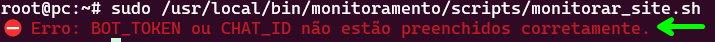

### 2. Preenchi os campos de BOT_TOKEN e CHAT_ID com as informações erradas:

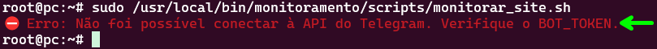

### 3. Não criei o diretório nem os arquivos de log:


### 4. Não criei apenas os arquivos de log:

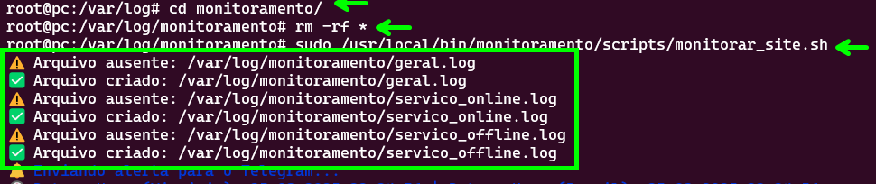

### 5. Deixei a pasta com apenas 1 arquivo de log faltando:

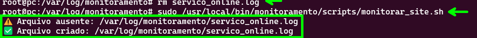

### 6.1. Verifiquei se o site está acessível (habilitando o nginx e conferindo seu status)


### 6.2. A notificação recebida pelo Telegram
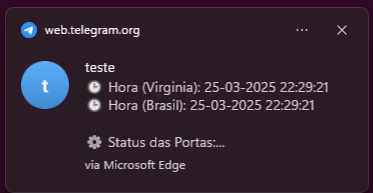

### 6.3. A mensagem que aparece no Telegram:
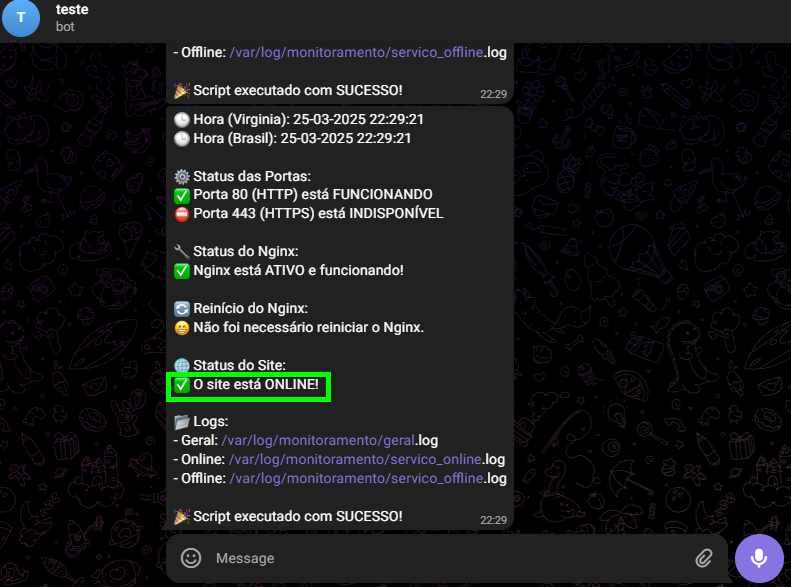

### 7.1. Removi os arquivos de log da pasta do nginx para ele não ser capaz de reiniciar

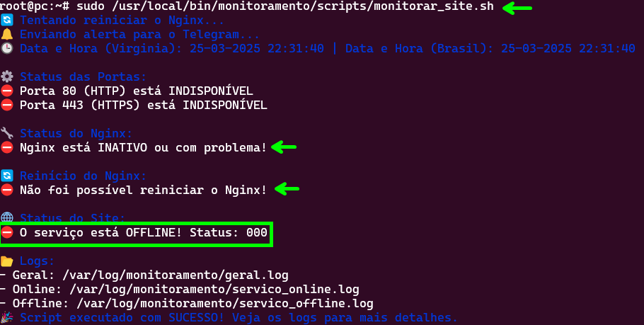

### 7.2. Mensagem recebida no Telegram

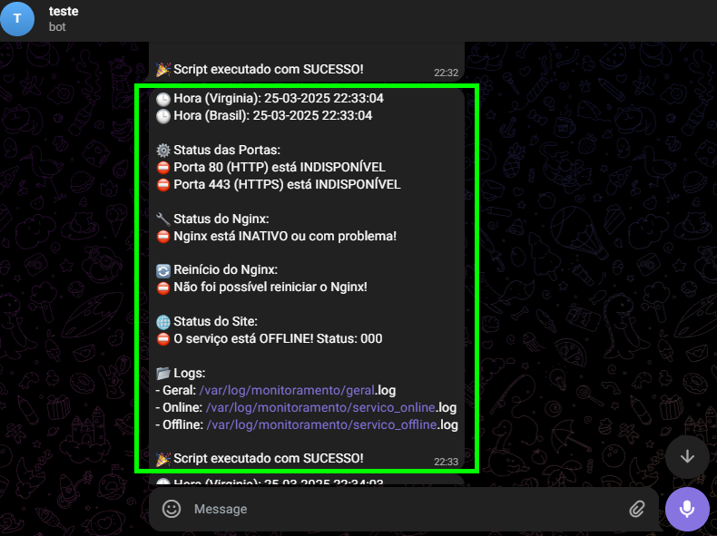

### 8.1. Para corrigir o erro acima, desinstalei o nginx e instalei novamente.
Após isso, parei o serviço para testar:

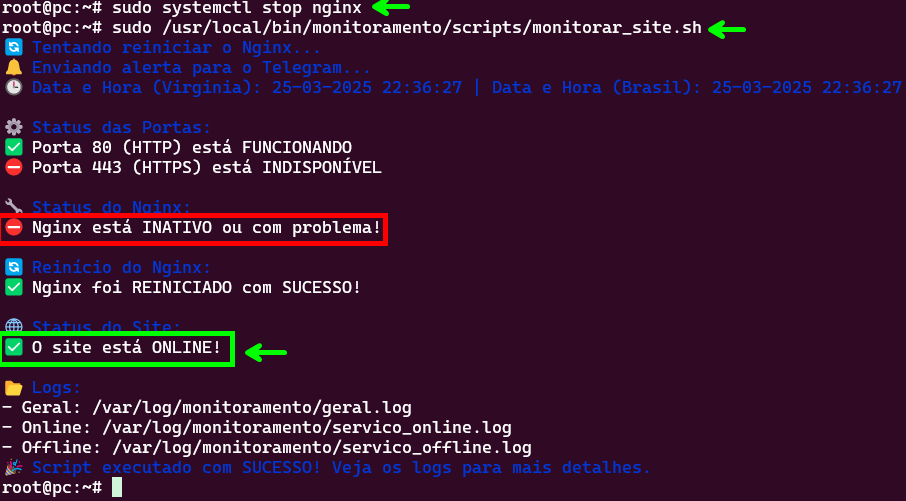

### 8.2. Mensagem recebida pelo Telegram
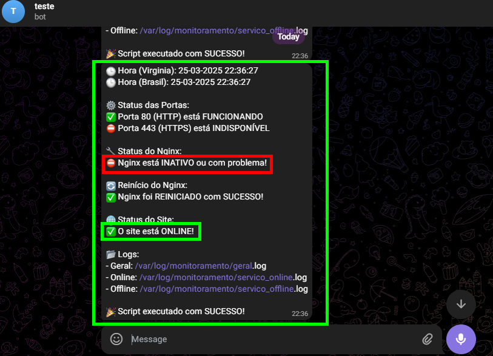

### 9. Verificando os arquivos de log em tempo real

```bash
tail -f /var/log/monitoramento/geral.log
```

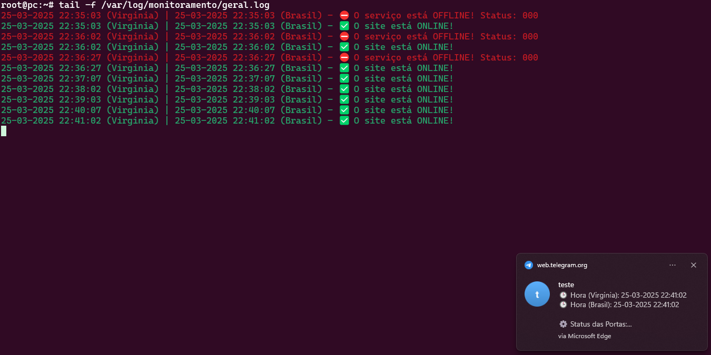

# Etapa Bônus: Automação com UserData 🎁 

## ❗Explicação do UserData
[🦘 Pular para o fim da Explicação](#-como-usar-o-userdata)

Abra com Ctrl + Clique: <a href="https://github.com/andrrade/Project1-CompassUOL-DevSecOps/blob/main/userdata.sh" target="_blank">📎 Arquivo UserData</a>

> [!IMPORTANT]\
> O código completo está nesse link, eu vou colocar todo o
código abaixo, mas explicando cada detalhe. Então se quiser
copiar ou baixar, abra o link.

O script `userdata` descrito é utilizado para configurar um servidor Linux (Ubuntu) com Nginx e preparar a infraestrutura para monitoramento de um site.

---

### **1. Atualizar o Sistema e Instalar Pacotes Necessários**
```bash
sudo apt update && sudo apt upgrade -y
```
- **Objetivo:** Atualiza a lista de pacotes disponíveis (`apt update`) e instala as atualizações de pacotes (`apt upgrade -y`) para garantir que o sistema esteja com as versões mais recentes de todos os pacotes.

---

### **2. Instalar o Nginx**
```bash
sudo apt install nginx -y
```
- **Objetivo:** Instala o servidor web Nginx no sistema. O `-y` permite que a instalação seja realizada sem solicitar confirmação.

---

### **3. Iniciar o Nginx**
```bash
sudo systemctl start nginx
```
- **Objetivo:** Inicia o serviço Nginx, permitindo que ele comece a responder às requisições HTTP.

---

### **4. Configurar o Git para Sparse-Checkout**
```bash
cd /tmp
git init
git remote add origin https://github.com/andrrade/Project1-CompassUOL-DevSecOps.git
git config core.sparseCheckout true
```
- **Objetivo:** Prepara o ambiente para fazer o **sparse-checkout**, uma técnica que permite fazer o download de uma parte específica de um repositório Git, em vez de todo o repositório.
  - `git init`: Inicializa um repositório Git local.
  - `git remote add origin`: Adiciona o repositório remoto do GitHub.
  - `git config core.sparseCheckout true`: Habilita o sparse-checkout.

---

### **5. Garantir que o conteúdo da pasta `meu-site/` seja baixado**
```bash
echo "meu-site/*" >> .git/info/sparse-checkout
```
- **Objetivo:** Especifica que o conteúdo dentro do diretório `meu-site/` deve ser baixado do repositório Git.

---

### **6. Baixar os Arquivos da Branch Main**
```bash
git pull origin main
```
- **Objetivo:** Baixa os arquivos da branch `main` do repositório Git e os coloca no diretório local do repositório.

---

### **7. Mover os Arquivos para o Diretório do Nginx**
```bash
sudo mv /tmp/meu-site/* /var/www/html/
```
- **Objetivo:** Move os arquivos do diretório `meu-site/` (baixados do repositório) para o diretório padrão do Nginx (`/var/www/html/`), onde os arquivos de site são armazenados.

---

### **8. Configurar o Nginx para Servir os Arquivos**
```bash
sudo nano /etc/nginx/sites-available/default <<EOF
server {
   listen 80;
   server_name localhost;

   root /var/www/html;
   index index.html;

   location / {
      try_files \$uri \$uri/ =404;
   }
}
EOF
```
- **Objetivo:** Configura o Nginx para servir o conteúdo do diretório `/var/www/html/`, incluindo a configuração de escuta na porta 80 e a tentativa de resolver arquivos e diretórios solicitados.

---

### **9. Reiniciar o Nginx para Aplicar as Configurações**
```bash
sudo systemctl restart nginx
```
- **Objetivo:** Reinicia o serviço Nginx para aplicar as novas configurações feitas no arquivo de configuração.

---

### **10. Habilitar o Nginx para Iniciar no Boot**
```bash
sudo systemctl enable nginx
```
- **Objetivo:** Configura o Nginx para iniciar automaticamente sempre que o sistema for reiniciado.

---

### **11. Configurar o Nginx para Reiniciar Automaticamente em Caso de Falhas**
```bash
sudo nano /etc/systemd/system/multi-user.target.wants/nginx.service <<EOF
[Service]
Restart=always
RestartSec=30
EOF
```
- **Objetivo:** Configura o Nginx para reiniciar automaticamente caso ocorra uma falha. O parâmetro `RestartSec=30` define um intervalo de 30 segundos antes da tentativa de reinício.

---

### **12. Atualizar o Sistema de Serviços**
```bash
sudo systemctl daemon-reload
```
- **Objetivo:** Atualiza o sistema de serviços para que ele reconheça as novas configurações do Nginx.

---

### **13. Criar Diretórios e Arquivos de Log**
```bash
sudo mkdir -p /var/log/monitoramento
sudo touch /var/log/monitoramento/servico_online.log /var/log/monitoramento/servico_offline.log /var/log/monitoramento/geral.log
```
- **Objetivo:** Cria diretórios e arquivos de log necessários para monitoramento do serviço, como logs de status online e offline do site.

---

### **14. Ajustar Permissões dos Arquivos de Log**
```bash
sudo chmod -R 755 /var/log/monitoramento
sudo chmod 666 /var/log/monitoramento/geral.log /var/log/monitoramento/servico_online.log /var/log/monitoramento/servico_offline.log
```
- **Objetivo:** Ajusta as permissões dos diretórios e arquivos de log para garantir que o sistema possa escrever nesses arquivos.

---

### **15. Criar Diretório para Scripts de Monitoramento**
```bash
sudo mkdir -p /usr/local/bin/monitoramento/scripts
```
- **Objetivo:** Cria um diretório onde scripts de monitoramento serão armazenados.

---

### **16. Baixar o Script de Monitoramento**
```bash
cd /tmp
curl -o /usr/local/bin/monitoramento/scripts/monitorar_site.sh https://raw.githubusercontent.com/andrrade/Project1-CompassUOL-DevSecOps/main/monitorar_site.sh
```
- **Objetivo:** Baixa o script de monitoramento a partir do repositório GitHub e o salva no diretório `/usr/local/bin/monitoramento/scripts/`.

---

### **17. Tornar o Script Executável**
```bash
sudo chmod +x /usr/local/bin/monitoramento/scripts/monitorar_site.sh
```
- **Objetivo:** Torna o script de monitoramento executável.

---

### **18. Instalar o Cron**
```bash
sudo apt install cron -y
```
- **Objetivo:** Instala o serviço de agendamento de tarefas `cron` no sistema, permitindo agendar a execução de tarefas repetitivas.

---

### **19. Habilitar o Serviço Cron para Iniciar no Boot**
```bash
sudo systemctl enable cron
```
- **Objetivo:** Configura o cron para iniciar automaticamente quando o sistema for reiniciado.

---

### **20. Configurar o Cron para Executar o Script a Cada 1 Minuto**
```bash
echo "*/1 * * * * /usr/local/bin/monitoramento/scripts/monitorar_site.sh" | sudo crontab -
```
- **Objetivo:** Configura o cron para executar o script de monitoramento a cada 1 minuto.

---

### **21. Finalização**
```bash
echo "Configuração completa. O servidor está pronto."
```
- **Objetivo:** Exibe uma mensagem de conclusão informando que a configuração foi realizada com sucesso e o servidor está pronto.

### 💡 Como usar o UserData
[🔼 Voltar ao Sumário](#sumário-)

Na hora que você estiver criando a instância EC2, a Última opção será `Advanced details`.
Abra essa opção:


Vá até o final dela e escolha subir um arquivo ou colar ele, e está pronto, é
só criar a instância.

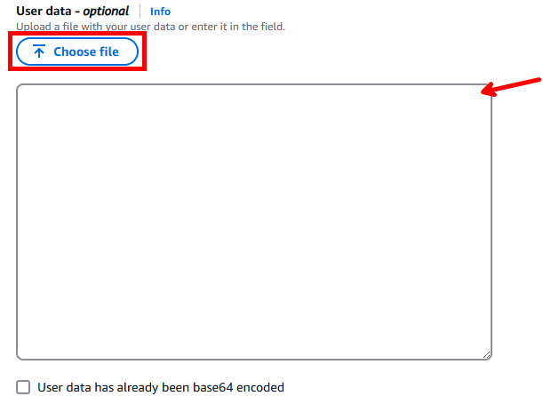

> [!WARNING]\
> ⚠️ Lembre-se de executar os seguintes passos também:

1. **Configuração do Security Group:**
   - Ao criar o Security Group, configure a regra HTTP para permitir acesso de qualquer IP (`0.0.0.0/0`).

2. **Seguir a Documentação:**
   - Execute o passo a passo da documentação, mas pare antes da **Etapa 2**, pois a partir desse ponto, o processo é automatizado com o uso do `UserData`.

3. **Criação do Bot do Telegram:**
   - Execute os passos para criar o bot do Telegram.

4. **Acessar a Instância e Configurar o Script:**
   - Acesse a instância pelo terminal e edite o script de monitoramento:

     ```bash
     sudo nano /usr/local/bin/monitoramento/scripts/monitorar_site.sh
     ```

   - Preencha as variáveis `BOT_TOKEN` e `CHAT_ID` com seus dados.

5. **Testar o Script:**
   - Você pode aguardar o script rodar automaticamente, já que ele está configurado para ser executado automaticamente.
   - Para testar manualmente, execute o seguinte comando:

     ```bash
     sudo /usr/local/bin/monitoramento/scripts/monitorar_site.sh
     ```

## 📈 Experiência sobre o Projeto
[🔼 Voltar ao Sumário](#sumário-)

Gostei bastante de participar do Projeto 1 da trilha! Foi uma experiência bastante desafiadora, mas extremamente gratificante. Durante o projeto, tive a oportunidade de aprender muitas coisas novas, especialmente sobre a configuração de servidores, monitoramento e automação de processos, que eram áreas com as quais eu ainda não tinha muita familiaridade.

O projeto me incentivou a estudar mais e a buscar entender cada detalhe do processo. Cada desafio foi uma oportunidade de aprofundar meu conhecimento e de aplicar novas habilidades de forma prática. Também percebi como a documentação é essencial, então me dediquei a detalhar cada passo do processo para garantir que tudo fosse bem compreendido, tanto por mim quanto por outras pessoas que possam acompanhar o projeto no futuro. Detalhar cada etapa me ajudou a consolidar o que aprendi e a criar um material útil para futuras implementações ou ajustes.

Esse projeto realmente despertou em mim a vontade de continuar estudando e explorando novas tecnologias e soluções. 

## 🔗 Extra - Exemplo
[🔼 Voltar ao Sumário](#sumário-)

Esse é um link exemplo para você ver como estava meu site no servidor: [Projeto 1 - Servidor](https://project1-compass-uol-dev-sec-ops.vercel.app/)

<p align="center">
  <br>
  
</p>
