<p align="center">
  
</p>
<br>

# Documentação do 1º Projeto - DevSecOps ♾️

> Orientações:
>
> - Explicar os comandos usados na documentação.
> - Compartilhar prints dos testes

# Sumário 📝

## Ferramentas Úteis

- [Ferramentas Necessárias](#-ferramentas-úteis)

## Pré-Requisitos

- [Pré-Requisitos](#-pré-requisitos)

## Etapa 1: Configuração do Ambiente

- [🌐 Criar VPC](#-1-criar-vpc)
- [🔑 Criar Chave (Key Pairs)](#-criar-chave-key-pairs)
- [🔐 Criar Security Group](#-criar-security-group)
- [🌐 Criar Instância EC2](#-2-criar-instância-ec2)
- [🌐 Acessar a Instância via SSH para Configurações Futuras](#-3-acessar-a-instância-via-ssh-para-realizar-configurações-futuras)

## Etapa 2: Configuração do Servidor Web

- [🌐 Instalando o Servidor Nginx na EC2](#-1-instalando-o-servidor-nginx-na-ec2)
- [🌐 Criar uma Página HTML Simples](#-2-criar-uma-página-html-simples-para-ser-exibida-pelo-servidor)
- [🌐 Configurar o Nginx para Servir a Página](#-3-configurar-o-nginx-para-servir-a-página-corretamente)

## Etapa 3: Monitoramento e Notificações

## 🔧 Ferramentas Úteis

[🔼 Voltar ao Sumário](#sumário-)

### ZoomIt da Microsoft para Prints de Tela com Setas

Para capturar telas com anotações, utilizei o ZoomIt da Microsoft.

- Documentação e instalação do ZoomIt: [ZoomIt - Sysinternals | Microsoft Learn](https://learn.microsoft.com/pt-br/sysinternals/downloads/zoomit)

## 📌 Pré-Requisitos

[🔼 Voltar ao Sumário](#sumário-)

Antes de iniciar a configuração, certifique-se de que possui os seguintes requisitos atendidos:

- **Conta ativa na AWS**

  > **O que é AWS?**
  > Amazon Web Services (AWS) é uma plataforma de computação em nuvem que fornece infraestrutura sob demanda, como servidores, armazenamento e bancos de dados, permitindo que desenvolvedores criem e escalem aplicações rapidamente.

- **WSL instalado no PC (caso esteja utilizando Windows)**

  > **O que é WSL?**
  > O Windows Subsystem for Linux (WSL) permite rodar um ambiente Linux diretamente no Windows sem precisar de uma máquina virtual, facilitando o desenvolvimento e administração de servidores remotos.

- Guia de instalação do Ubuntu no Windows: [How to install Ubuntu on Windows 10 from Microsoft Store](https://www.youtube.com/watch?v=La8jIAAANSA&t=203s)
- Documentação do WSL: [Documentação do Subsistema Windows para Linux | Microsoft Learn](https://learn.microsoft.com/pt-br/windows/wsl/)

> **Observação:** Minha console está em inglês. Caso os nomes dos menus estejam diferentes na sua, pode ser devido ao idioma configurado.

> Tudo que aparecer borrado foi para priorizar a segurança

---

# Etapa 1: Configuração do Ambiente ☁️

## 🌐 1. Criar VPC

[🔼 Voltar ao Sumário](#sumário-)

A **Virtual Private Cloud (VPC)** é uma rede virtual isolada dentro da AWS onde serão configurados os recursos do projeto.

### Passo a passo:

1. No console da tela inicial da AWS, vá até a lupa e pesquise por "VPC" e clique em "Your VPCs".

   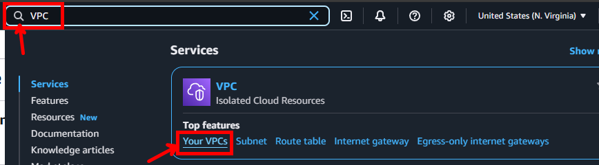

2. Irá abrir a página de gerenciamento de VPCs. Clique em **"Create VPC"**.

   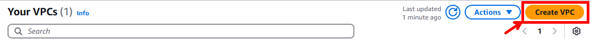

3. Nas configurações:

   - Selecione **"VPC and more"**.
     > Essa opção permite criar não apenas uma VPC, mas também configurar automaticamente subnets, tabelas de roteamento e gateways necessários para a comunicação da rede. Ao escolher essa opção, a AWS ajuda a configurar um ambiente de rede mais completo sem precisar definir manualmente cada componente.
   - Marque "Auto-generate"
     > Quando essa opção está ativada, a AWS gera automaticamente os CIDR blocks e distribui as subnets nas Availability Zones da região escolhida. Isso simplifica a configuração inicial, garantindo que os endereços IP fiquem organizados corretamente dentro da VPC.
   - Defina um nome para sua VPC (exemplo: "project")
   - Defina o **IPv4 CIDR block** como **10.0.0.0/16**
     > **O que é IPv4 CIDR block?**
     > CIDR (Classless Inter-Domain Routing) é um método para definir intervalos de endereços IP. O bloco **10.0.0.0/16** significa que a VPC pode ter até 65.536 endereços IP disponíveis dentro deste intervalo.

   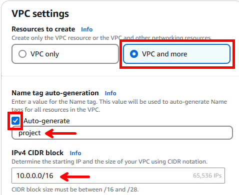

4. Nas configurações:

   - Selecione **No IPv6 CIDR block**

     > **O que é IPv6 CIDR block?**
     > Diferente do IPv4, o IPv6 usa um esquema de endereçamento maior e mais complexo. No projeto, optei não utilizar IPv6.

   - **Tenancy**: "Default"

     > **O que é Tenancy?**
     > Define como os recursos da AWS são alocados. A opção "Default" significa que a VPC compartilhará a infraestrutura física da AWS com outros usuários, reduzindo custos.

   - **Número de AZs (Availability Zones)**: 2
   - Customizei para "us-east-1a" (Virgínia) e "us-east-1b" (Ohio)

   > **O que são Availability Zones (AZs)?**
   > Availability Zones são localizações distintas dentro de uma região AWS. Cada região possui múltiplas AZs, que são centros de dados isolados fisicamente, garantindo maior disponibilidade e tolerância a falhas.

   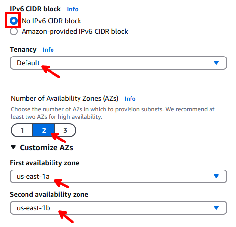

5. Como o projeto exige, configurei **duas subnets públicas e duas privadas**.

   > **O que são subnets públicas e privadas?**
   >
   > - **Subnets públicas**: Permitem comunicação direta com a internet através de um Internet Gateway.
   > - **Subnets privadas**: Ficam isoladas da internet e precisam de um NAT Gateway para acessar recursos externos.

   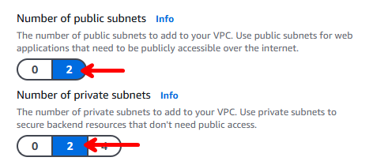

6. Configure o CIDR block das subnets como **10.0.0.0/20**.

   > **O que significa CIDR block das subnets como 10.0.0.0/20?**
   > Cada subnet recebe uma parte do bloco de endereços da VPC. **/20** significa que cada subnet pode ter até 4.096 endereços IP disponíveis.

   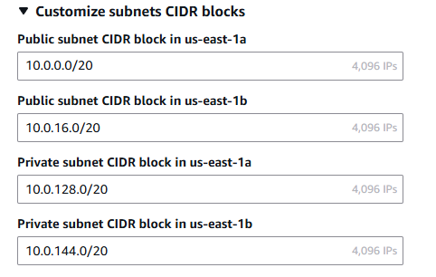

7. Configure as opções adicionais:

   - **NAT Gateways ($):** "None"

   > **O que é NAT Gateway?**
   > Um NAT Gateway permite que instâncias em subnets privadas acessem a internet sem serem diretamente acessíveis por ela.

   - **VPC Endpoints:** Selecione "S3 Gateway"

   > **O que são VPC Endpoints e S3 Gateway?**
   > Um **VPC Endpoint** permite que recursos dentro da VPC se comuniquem com serviços da AWS sem passar pela internet. O **S3 Gateway** é um tipo de endpoint usado para acessar o Amazon S3 de forma segura e eficiente.

   - **Habilitar DNS:** Marque as opções "Enable DNS hostnames" e "Enable DNS resolution"

   > **O que é DNS e por que habilitá-lo?**
   > O DNS (Domain Name System) traduz endereços IP em nomes legíveis. Habilitá-lo permite que instâncias dentro da VPC se comuniquem mais facilmente usando nomes ao invés de IPs.

   - **Tags:** Não adicionei tags extras

   > **O que são Tags?**
   > Tags são rótulos personalizáveis usados para organizar e identificar recursos dentro da AWS, facilitando a administração.

8. Clique em **"Create VPC"** para finalizar a configuração.

   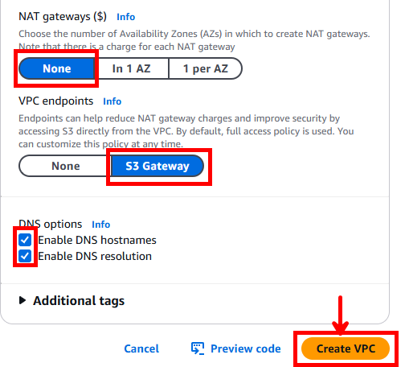

9. O preview final ficará assim:

   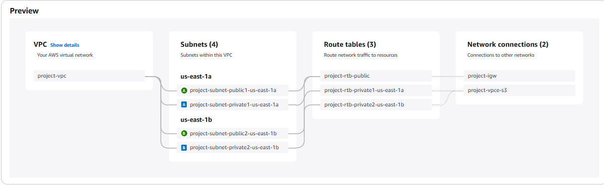

---

### 🔑 Criar Chave (Key Pairs)

[🔼 Voltar ao Sumário](#sumário-)

As **Key Pairs** (pares de chaves) são utilizadas para acessar a instância EC2 com segurança via SSH. Elas consistem em:

- **Chave pública**: Fica armazenada na AWS e é associada à instância.
- **Chave privada**: Deve ser baixada e armazenada localmente pelo usuário. Ela é necessária para autenticação SSH.

> ⚠️ **Atenção**: Se você perder a chave privada, **não poderá acessar sua instância EC2**.

### Passo a passo::

1. No menu da AWS, clique no ícone de pesquisa e digite **"Key Pairs"**. Em seguida, clique na opção correspondente.

   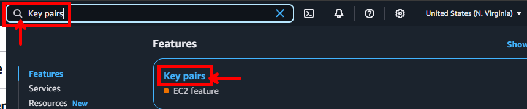

2. Clique em **"Create key pair"**.

   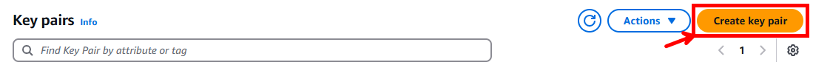

3. Configure a chave com as seguintes opções:

   - **Nome**: Escolha um nome para a chave. No exemplo, usei `"key-project"`.
   - **Tipo de chave**: Selecione **"RSA"**, pois é um dos algoritmos de criptografia mais utilizados para SSH.
   - **Formato da chave privada**: Escolha **".pem"**. Esse formato é necessário para conexões SSH no Linux e Mac.

4. Clique em **"Create key pair"**.

5. O download da chave privada será feito automaticamente.

   > ⚠️ **Guarde esse arquivo em um local seguro** e LEMBRE do lugar que você
   > a armazenar, pois ele será necessário para acessar a instância EC2 posteriormente.

6. Não adicionei nenhuma tag

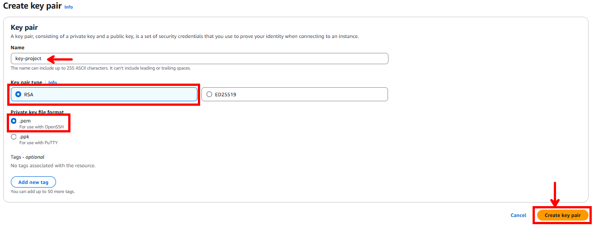

---

### 🔐 Criar Security Group

[🔼 Voltar ao Sumário](#sumário-)

Os **Security Groups** atuam como **firewalls virtuais** para as instâncias EC2. Eles controlam o tráfego de entrada e saída, permitindo apenas conexões autorizadas.

### Passo a passo:

1. No menu da AWS, clique no ícone de pesquisa e digite **"Security Groups"**. Em seguida, clique na opção correspondente.

   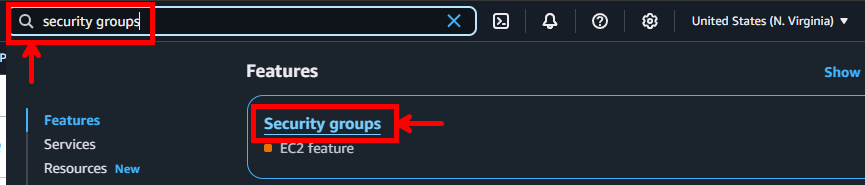

2. Clique em **"Create security group"**.

   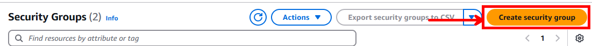

3. Configure os seguintes campos:

   - **Nome**: Escolha um nome para o grupo. No exemplo, utilizei `"security-group-project"`.
   - **Descrição**: Insira uma breve descrição. No meu exemplo utilizei
     `"teste"`.
   - **VPC**: Selecione a **VPC criada anteriormente**. No exemplo, `"project-vpc"`.

   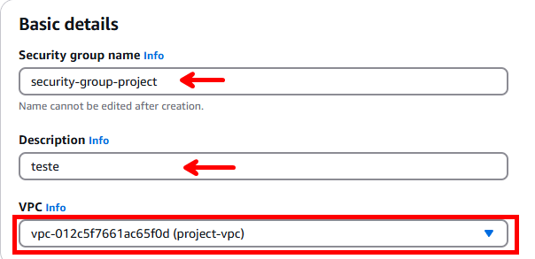

#### Configuração das Regras de Entrada (Inbound Rules)

As **Inbound Rules** determinam quais conexões externas podem acessar a instância.

4. Clique em **"Add Rule"** para adicionar regras de entrada.

   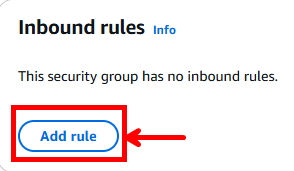

5. Adicione as seguintes regras:

   - **SSH (porta 22)**

     - **Tipo**: SSH
     - **Protocolo**: TCP
     - **Port Range**: 22
     - **Source (Origem)**: **My IP** (recomendado por causa da seguraça)
       > Permite que **apenas o seu IP atual** acesse a instância via SSH. Isso evita acessos indesejados.

   - **HTTP (porta 80)**
     - **Tipo**: HTTP
     - **Protocolo**: TCP
     - **Port Range**: 80
     - **Source (Origem)**: **My IP** (inicialmente por causa da segurança,
       após todas as configurações, deixaremos como **0.0.0.0/0**)
       > Permite apenas o seu IP acessar o servidor web (por enquanto).
       > Após todas as configurações será necessário mudar a origem do HTTP para
       > **0.0.0.0/0**, permitindo que qualquer usuário da internet acesse a página hospedada na instância.

   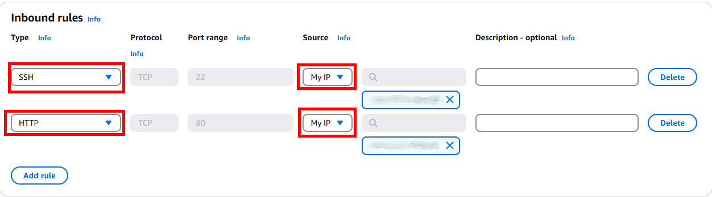

#### Configuração das Regras de Saída (Outbound Rules)

As **Outbound Rules** definem quais conexões **a instância pode iniciar** para outros servidores.

7. Em **Outbound Rules**, configure:

   - **Tipo**: `"All traffic"`
   - **Protocolo**: `"All"`
   - **Port Range**: `"All"`
   - **Destination**: `"Anywhere - IPv4 (0.0.0.0/0)"`

   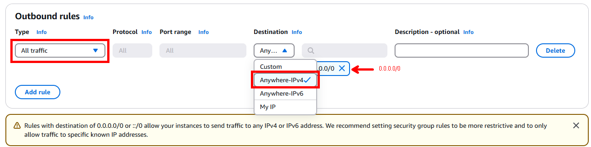

   > Isso permite que a instância **acesse qualquer serviço na internet**, como atualizações de pacotes e APIs externas.

8. **Tags (Opcional)**  
   Não adicionei nenhuma tag.

   - Se desejar, adicione **tags** para melhor organização.
     > As tags são úteis para identificar recursos, especialmente em ambientes grandes com várias instâncias.

9. Clique em **"Create security group"**.

   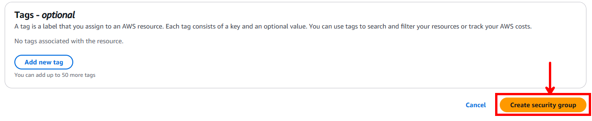

---

## 🌐 2. Criar Instância EC2

[🔼 Voltar ao Sumário](#sumário-)

A **instância EC2 (Elastic Compute Cloud)** é um **servidor virtual na nuvem** que executará o Nginx e o script de monitoramento. Nesta seção, vamos criar uma instância utilizando o **Ubuntu Server** e configurá-la corretamente para rodar o ambiente de monitoramento.

---

### Passo a passo:

### 1.0. Acessar a Página de Instâncias

1.1. No menu da AWS, clique no **ícone de pesquisa** e digite **EC2**.
1.2. Clique na opção **"Instances"** para acessar a lista de instâncias existentes.

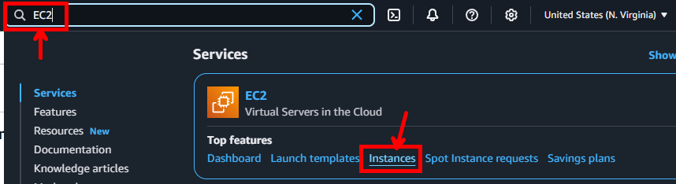

---

### 2.0. Criar uma Nova Instância

2.1. Na tela que abrir, clique em **"Launch Instances"** para iniciar o processo de criação de uma nova instância EC2.

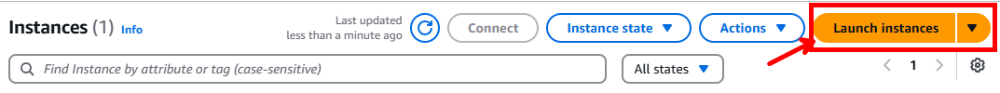

---

### 3.0. Configurar Detalhes da Instância

Tags

> ⚠️ **Nota**: No meu caso, utilizei **tags privadas**, então não posso mostrá-las.  
> No entanto, é **altamente recomendado** que você adicione suas próprias tags para facilitar a identificação dos recursos na AWS, especialmente em ambientes de produção.

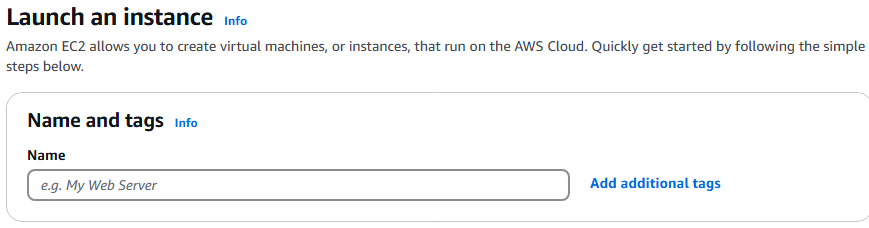

---

### 4.0. Escolher a Imagem do Sistema Operacional

4.1. **Selecionar a AMI (Amazon Machine Image)**:

- Escolha a imagem **Ubuntu Server 24.04 LTS**.

> A **AMI (Amazon Machine Image)** é uma imagem pré-configurada que contém o sistema operacional e, opcionalmente, aplicativos necessários para iniciar a instância EC2. O **Ubuntu Server** foi escolhido devido à sua popularidade, leveza, segurança e suporte comunitário robusto. Além disso, a distribuição Ubuntu é amplamente utilizada em ambientes de produção, o que a torna uma escolha sólida para este projeto.

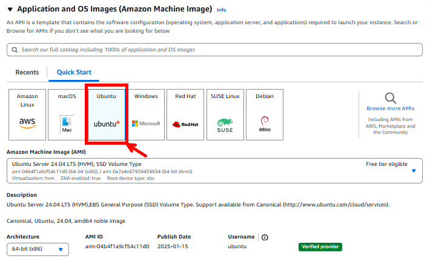

---

### 5.0. Escolher o Tipo da Instância

5.1. **Selecionar o Tipo de Instância**:

- Escolha **t2.micro**.

> A instância **t2.micro** é parte do **Free Tier da AWS**, permitindo que novos usuários utilizem esta instância gratuitamente por até **750 horas mensais**. Com **1 vCPU e 1 GiB de memória RAM**, essa instância é adequada para rodar um servidor web simples com Nginx e o script de monitoramento. A **família T2** também oferece **créditos de CPU burstável**, permitindo que a instância lide com picos de uso sem impactar o desempenho.

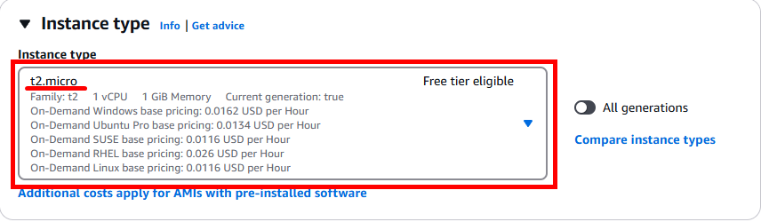

---

### 6.0. Selecionar a Chave SSH

6.1. **Selecionar a Key Pair**:

- Escolha a **Key Pair** que foi criada anteriormente.
- No meu caso, escolhi a chave **"key-project"**.

> A **Key Pair** é necessária para acessar a instância via SSH. Sem essa chave, você não conseguirá realizar o login na instância.

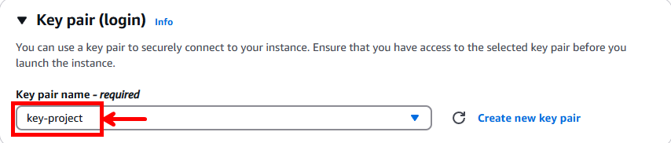

---

### 7.0. Configurar Rede (Networking)

7.1. Em **Networking settings**, clique em **"Edit"**.

7.2. Configure os seguintes parâmetros:

- **VPC**: Escolha a **VPC** criada anteriormente.

  - No meu caso, a VPC criada foi chamada **"project-vpc"**.

- **Subnet**: Selecione a **sub-rede pública** correspondente à sua região principal.

  > A **sub-rede pública** é fundamental, pois ela garante que sua instância EC2 tenha conectividade externa, o que é essencial para disponibilizar serviços como um servidor web acessível pela internet.

  > No meu caso, a VPC foi criada nas regiões **Virgínia (us-east-1)** e **Ohio (us-east-2)**, então escolhi a sub-rede pública de Virgínia: `"public1-us-east-1a"`.

- **Auto-assign Public IP**: Marque **Enable**.

  > Isso atribui um IP público à instância, permitindo que você a acesse via **SSH** e também a torne acessível externamente (essencial para um servidor web).

  7.3. Em **Firewall (Security Groups)**:

- Escolha a opção **"Select existing security group"**.
- Selecione o **Security Group** criado anteriormente, chamado **"security-group-project"**.

> O **Security Group** age como um firewall virtual, controlando o tráfego de entrada e saída da instância EC2. Ele garante que apenas o tráfego autorizado, como acesso SSH, seja permitido.

7.4. Em **Advanced networking configuration**, **não alterei nada** (deixei os valores padrão).

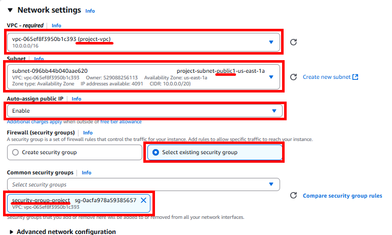

---

### 8.0. Configurar o Armazenamento

8.1. Em **Configure Storage**, defina o armazenamento para **1x8 GiB gp3**.

> A **gp3** é uma opção de armazenamento sólido (SSD) com bom custo-benefício, adequada para a maioria dos casos de uso, incluindo servidores web simples.

8.2. Clique em **"Launch Instance"** para finalizar o processo de criação da instância.

8.3. Aguarde alguns instantes até que a instância esteja ativa.

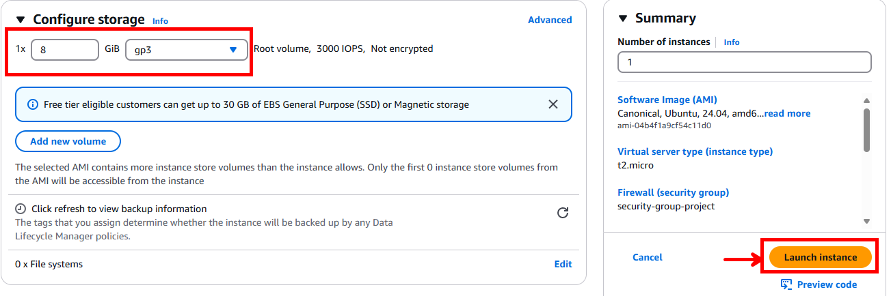

---

## 🌐 3. Acessar a instância via SSH para realizar configurações futuras.

[🔼 Voltar ao Sumário](#sumário-)

### Passo a passo:

### 1.0. Acessando a Instância EC2

1.1. Abra o seu WSL e navegue até o diretório onde a chave de acesso (Key Pair) foi armazenada:

> Lembre-se de onde você armazenou a chave no começo

No meu caso, foi:

```bash
   cd /mnt/c/Users/andra/OneDrive/Documentos/Project1-AWS
```

1.2. Liste o conteúdo da pasta para confirmar que a chave está presente:

```bash
   ls
```

1.3. Copie a chave para o diretório home (usei esse diretório por ser mais fácil localizar, mas pode copiá-la para onde preferir):

```bash
   cp key-project.pem ~
```

1.4. Volte para o diretório home:

```bash
   cd
```

Ou:

```bash
   cd ~
```

> Prefiro e utilizo o cd por ser mais rápido e dar mais agilidade

1.5. Liste os arquivos para confirmar se a chave foi copiada corretamente:

```sh
ls
```


1.6. Verifique as permissões da chave:

```bash
   ls -lh key-project.pem
```

A saída inicial pode ser algo como:

```bash
   -rwxr-xr-x 1 root root ...
```

> O primeiro conjunto de caracteres representa as permissões do arquivo:
>
> - `r` (read), `w` (write) e `x` (execute).
> - O padrão `-rwxr-xr-x` indica que o arquivo pode ser lido, escrito e executado pelo proprietário, e apenas lido e executado por outros usuários.

1.7. Ajuste as permissões da chave para garantir segurança na conexão:

```bash
   chmod 400 key-project.pem
```

> Isso restringe as permissões para que apenas o usuário dono da chave possa lê-la, garantindo maior segurança.

1.8. Verifique novamente as permissões:

```bash
   ls -lh key-project.pem
```

Saída esperada:

```bash
   -r-------- 1 root root ...
```

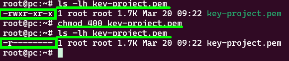

### 2.0. Obtendo o Endereço IP da Instância

2.1. Acesse o console da AWS e abra o painel de EC2.

2.2. No menu lateral, clique em **Instances**.

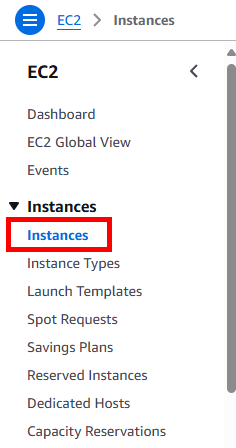

2.3. Selecione a instância criada.

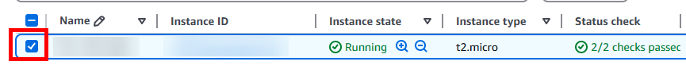

2.4. Na aba **Details**, copie o **Public IPv4 address**.

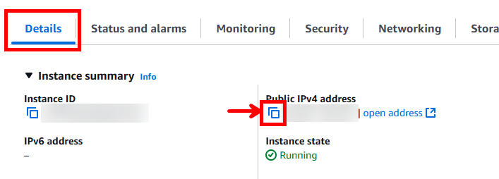

### 3.0. Testando a Conexão

3.1. No WSL, teste a conexão com a porta 22 (SSH) usando telnet:

```bash
   telnet SEU_IP_AQUI 22
```

3.2. Se a conexão for bem-sucedida, aparecerá uma mensagem do tipo:

```bash
   Connected to SEU_IP_AQUI
```

3.3. Digite `q` e pressione **Enter** para sair.


### 4.0. Conectando-se à Instância via SSH

4.1. Utilize o seguinte comando para conectar-se à instância:

```bash
   ssh -i key-project.pem ubuntu@SEU_IP_AQUI
```

4.2. Ao conectar pela primeira vez, digite `yes` para aceitar a chave do servidor.
4.3. Se a conexão for bem-sucedida, a saída incluirá uma mensagem similar a:

```bash
   Welcome to Ubuntu 24.04.1 LTS (GNU/Linux 6.8.0-1021-aws x86_64)
```

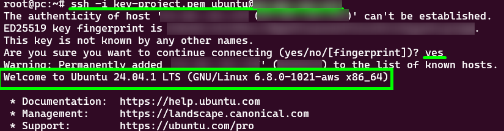

# Etapa 2: Configuração do Servidor Web ☁️

[🔼 Voltar ao Sumário](#sumário-)

> Orientações:
>
> - Personalizar a página com informações sobre o projeto.
> - Criar um serviço systemd para garantir que o Nginx reinicie automaticamente se parar

Nesta etapa, vamos configurar um servidor web Nginx para exibir uma página HTML personalizada em nossa instância EC2, com todas as configurações adequadas para servir o conteúdo do site.

## 🌐 1. Instalando o Servidor Nginx na EC2

[🔼 Voltar ao Sumário](#sumário-)

1.1. Primeiro, vamos atualizar os pacotes do sistema e instalar o servidor Nginx:

```bash
   sudo apt update && sudo apt upgrade -y
```

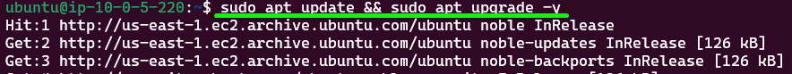

> Obs: isso talvez demore um pouco

### 2.0. Instalação do Nginx:

```bash
   sudo apt install nginx -y
```

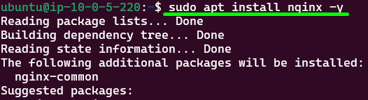

2.1. Após a atualização, verifique se o Nginx foi instalado corretamente:
> **Resultado esperado**: A versão do Nginx instalada será exibida, confirmando que a instalação foi bem-sucedida.

```bash
   nginx -v
```


2.3. Agora, vamos iniciar o Nginx e verificar se está funcionando corretamente:

```bash
   sudo systemctl start nginx
```

2.4. Verifique o status do Nginx para garantir que ele está ativo:

```bash
   sudo systemctl status nginx
```

2.5. Pressione `CTRL + C` para sair.

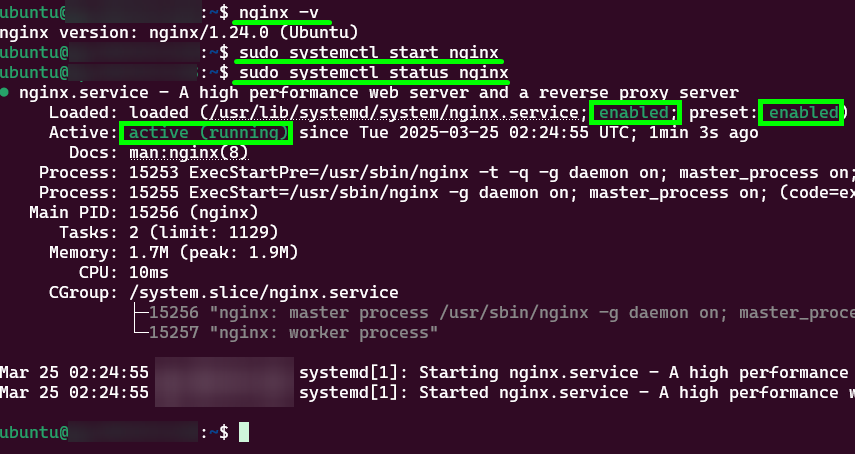

> **Resultado esperado**: O Nginx deve estar ativo e em execução.

---

## 🌐 2. Criar uma página HTML simples para ser exibida pelo servidor.

[🔼 Voltar ao Sumário](#sumário-)

Eu deixei minha pasta com os arquivos do site na pasta:

`/mnt/c/Users/andra/OneDrive/Documentos/Project1-AWS/site-projeto1-compassuol/`

> Você pode criar o seu site como preferir e lembrar do local onde o guardou.
>
> Também disponibilizei nessa documentação os arquivos que criei na pasta chamada **"meu-site"**, que contém o mesmo conteúdo dos resultados apresentados a seguir.

2.1. Abra seu WSL sem ser o que tem a instância, o da sua
máquina mesmo.

```bash
   scp -i "~/key-project.pem" -r "/mnt/c/Users/andra/OneDrive/Documentos/Project1-AWS/site-projeto1-compassuol/" ubuntu@SEU_IP:/home/ubuntu/
```


2.2. Volte para o terminal conectado à instância e execute os comando:

```bash
sudo mv /home/ubuntu/site-projeto1-compassuol/* /var/www/html/
```

```bash
cd /var/www/html
```

```bash
ls
```


## 🌐 3. Configurar o Nginx para servir a página corretamente

[🔼 Voltar ao Sumário](#sumário-)

3.1. Edite o arquivo de configuração padrão do Nginx para apontar para sua página:

```bash
   sudo nano /etc/nginx/sites-available/default
```

3.2. Apague o conteúdo existente e substitua pelo seguinte:

```bash
server {
   listen 80;
   server_name localhost; # Nome do servidor (pode ser um domínio ou IP)

   root /var/www/html; # Caminho onde os arquivos do site estão armazenados
   index index.html;

   location / {
      try_files $uri $uri/ =404;
   }
}
```

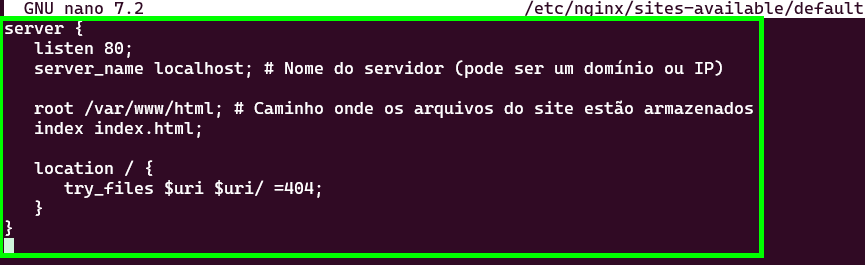

3.3. Para salvar e sair do editor `nano`, pressione `CTRL + X`, depois `Y` e `ENTER`.

3.4. Agora, teste se a configuração do Nginx está correta:

```bash
   sudo nginx -t
```

3.5. Se não houver erros, reinicie o Nginx para aplicar as alterações:

```bash
   sudo systemctl restart nginx
```

3.6. Também é possível verificar se a página HTML está sendo servida corretamente utilizando o `curl`:

```bash
   curl http://localhost
```

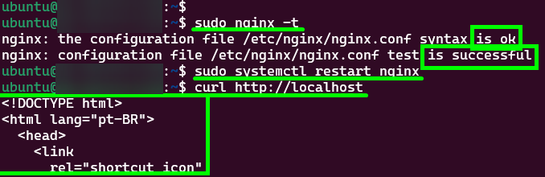

---

### 4.0. Acessando o Site

4.1. Agora, você pode acessar sua página web digitando o `IP público` da sua instância EC2 no navegador ou utilizando `localhost` caso esteja testando localmente.

Se o servidor Nginx estiver em execução corretamente, você verá a página com as informações sobre o projeto.

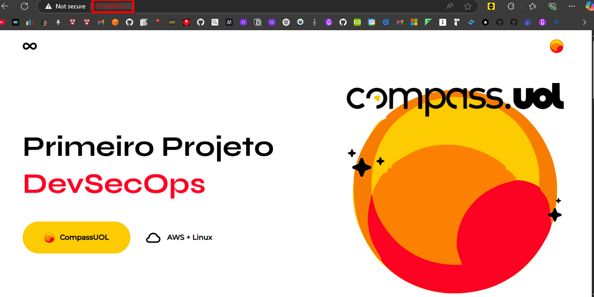

---

### 5.0. Criar um serviço systemd para garantir que o Nginx reinicie automaticamente se parar

5.1. Para garantir que o Nginx sempre inicie ao ligar a instância, execute o seguinte comando:

```bash
   sudo systemctl enable nginx
```

Isso assegura que o serviço seja inicializado automaticamente no boot do sistema.

5.3. Configuração para Reinício Automático do Nginx em Caso de Falha:

- Edite o arquivo de serviço do Nginx:

  ```bash
   sudo nano /etc/systemd/system/multi-user.target.wants/nginx.service
  ```

  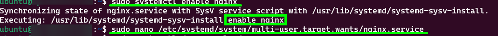

- Adicione as seguintes linhas à seção `[Service]`:

  ```bash
   Restart=always
   RestartSec=30
  ```

  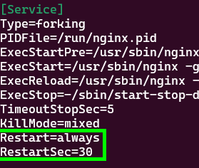

  > **Restart=always**: Garante que o Nginx reinicie sempre que ele falhar.
  >
  > **RestartSec=30**: Define o tempo de espera (em segundos) antes de tentar reiniciar o Nginx.

Recarregue o sistema para aplicar as alterações:

```bash
   sudo systemctl daemon-reload
```

5.4. Teste se a reinicialização automática funcionou simulando uma falha da seguinte maneira:

- Obtenha o ID do processo (PID) do Nginx com o comando:
  ```bash
  ps aux | grep nginx
  ```
- O PID do processo mestre do Nginx será o número exibido antes de `nginx: master process`.

   <!--  -->

Mate o processo do Nginx (simulando uma falha) com o comando:

   ```bash
      sudo kill -9 <PID>
   ```
> Explicar o kill -9

- Substitua `<PID>` pelo ID do processo mestre do Nginx.
- Verifique o status do Nginx:

  ```bash
   sudo systemctl status nginx
  ```

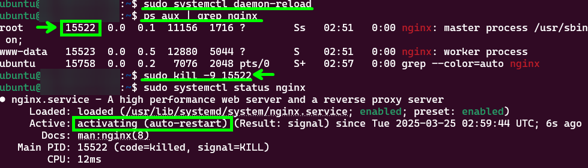

Enquanto isso, a página HTML ficará fora do ar.
Assim que a reinicialização estiver completa, o Nginx voltará a ficar ativo e a página HTML será exibida novamente.

# Etapa 3: Monitoramento e Notificações

[🔼 Voltar ao Sumário](#sumário-)

> Usar curl no Bash ou requests no Python para testar a resposta do site
> Configurar um bot do Telegram ou webhook do Discord/Slack para receber alertas

## 🤖 Criando o Bot no Telegram

Abra o Telegram e pesquise por `BotFather` e clique.
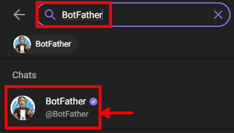

Dê um `/newbot` para criar um novo bot
Escolha um nome para o bot, no meu caso `teste`
Escolha um username pro seu bot, tem que terminar com `_bot`. No
meu caso `exemploTestePB2503_bot`
Ele vai te mandar uma mensagem e você vai clicar nesse link com a setinha.
> ⚠️ SALVE o token to access the HTTP API, no meu caso, está borrado por
segurança.
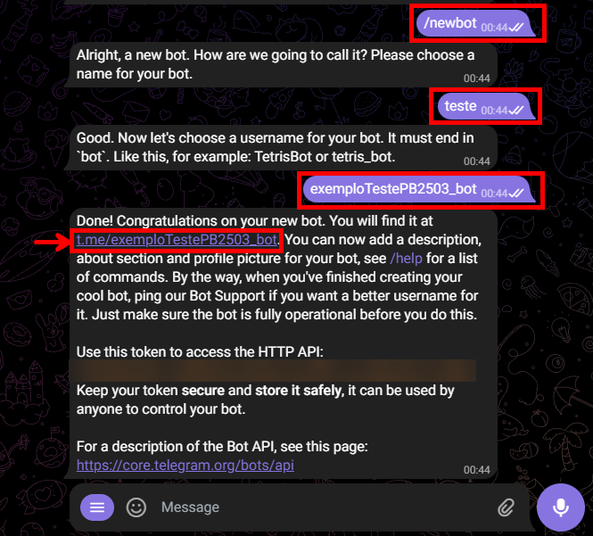

Clique em `Start`
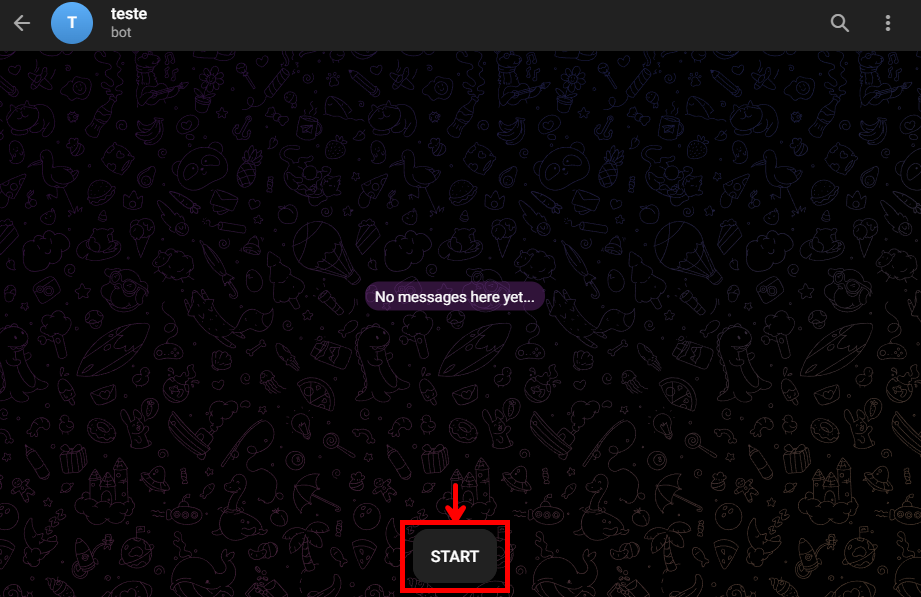

No Ubuntu execute os comandos:

```bash
   sudo apt install jq -y 
```

```bash
curl https://api.telegram.org/botSEU_TOKEN/getUpdates | jq
```

Sua mensagem pode sair algo tipo: 
{"ok":true,"result":[]}

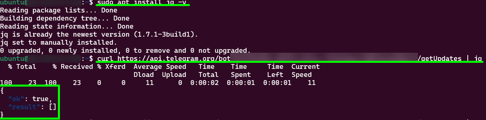

Mande uma mensagem de teste para iniciar o chat do seu bot
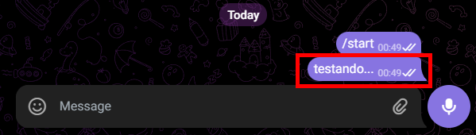

Volte par o terminal e refaça o comando:
```
curl https://api.telegram.org/botSEU_TOKEN/getUpdates | jq
```

Agora nessa saída aparecerá o chat_id:

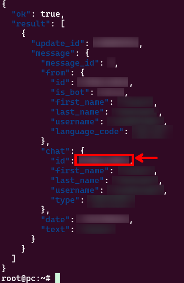
> ⚠️ SALVA o chat_id, no meu caso está borrado por
segurança.


## 🌐 1. Criar um script em Bash ou Python para monitorar a disponibilidade do site.

[🔼 Voltar ao Sumário](#sumário-)

### 1.1. Criação das Pastas de Logs
Criando a pasta `monitoramento` dentro de `/var/log`

```bash
   sudo mkdir -p /var/log/monitoramento
```

Criando os três arquivos de log: 
1. Arquivo `servico_online.log`: 

```bash
   sudo touch /var/log/monitoramento/servico_online.log
```

2. Arquivo `servico_offline.log`:

```bash
   sudo touch /var/log/monitoramento/servico_offline.log
```

3. Arquivo `geral.log`:

```bash
   sudo touch /var/log/monitoramento/geral.log
```

### 1.2. Listagem e Verificação das Permissões

Listando os arquivos dentro do diretório `/var/log/monitoramento` para verificar se eles existem.

```bash
   ls -l /var/log/monitoramento/
```

Mudando a propriedade dos arquivos e pastas para o usuário atual.

```bash
   sudo chmod -R 755 /var/log/monitoramento
```

> Altera as permissões para garantir que você tenha permissão para ler, escrever e executar arquivos nessa pasta, enquanto outros usuários podem apenas ler e executar.

Verifique novamente os arquivos e permissões:

```bash
   ls -l /var/log/monitoramento/
```

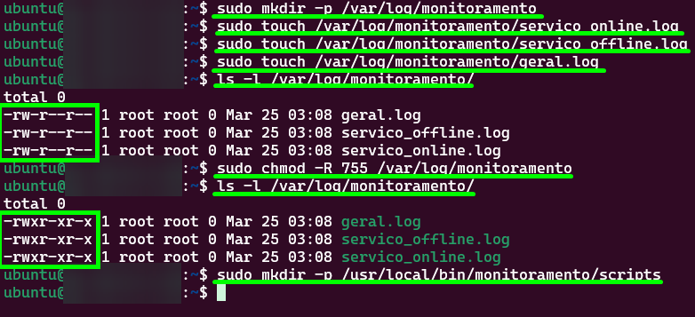

#### 1.3. Criação da Pasta para Scripts

Criando a pasta onde você armazenará os scripts de monitoramento: pasta `/usr/local/bin/monitoramento/scripts`

```bash
   sudo mkdir -p /usr/local/bin/monitoramento/scripts
```

## 🌐 2.1. O script deve verificar se o site responde corretamente a uma requisição HTTP.

Criando o arquivo de script `monitorar_site.sh`.

```bash
   sudo nano /usr/local/bin/monitoramento/scripts/monitorar_site.sh
```

Script que verifica se o serviço está online ou offline e grava a informação no log:

```bash
#!/usr/bin/env bash

# Defina as variáveis de configuração
BOT_TOKEN="" # PREENCHA AQUI O TOKEN GERADO PELO BOT
CHAT_ID="" # PREENCHA SEU CHAT_ID
LOGS="/var/log/monitoramento/geral.log"
LOG_ONLINE="/var/log/monitoramento/servico_online.log"
LOG_OFFLINE="/var/log/monitoramento/servico_offline.log"

# Defina as variáveis de cor
COR_OK="\033[32m"
COR_ALERTA="\033[31m"
COR_INFO="\033[34m"
COR_RESET="\033[0m"

# Função para verificar se o token e chat_id estão preenchidos corretamente
verificar_configuracao() {
   if [ -z "$BOT_TOKEN" ] || [ -z "$CHAT_ID" ] || [ "$BOT_TOKEN" == "PREENCHA AQUI O TOKEN GERADO PELO BOT" ] || [ "$CHAT_ID" == "PREENCHA SEU CHAT_ID" ]; then
      echo -e "${COR_ALERTA}⛔ Erro: BOT_TOKEN ou CHAT_ID não estão preenchidos corretamente.${COR_RESET}"
      exit 1
   fi
}

# Função para enviar alerta para o Telegram
enviar_alerta() {
   local MENSAGEM="$1"
   echo -e "${COR_INFO}🔔 Enviando alerta para o Telegram...${COR_RESET}"
   curl -s -X POST "https://api.telegram.org/bot$BOT_TOKEN/sendMessage" \
      -d "chat_id=$CHAT_ID" \
      -d "text=$MENSAGEM" > /dev/null 2>&1
}

# Função para verificar o status do site
verificar_status_site() {
   STATUS=$(curl -s -o /dev/null -w "%{http_code}" http://localhost)
   TIME=$(date "+%d-%m-%Y %H:%M:%S")
   
   case $STATUS in
      200)
            SITE_STATUS="✅ O site está ONLINE!"
            # Registro no log de online com cor
            echo -e "\033[32m$TIME - $SITE_STATUS\033[0m" >> "$LOG_ONLINE"
            # Registro no log geral com cor
            echo -e "\033[32m$TIME - $SITE_STATUS\033[0m" >> "$LOGS"
            ;;
      *)
            SITE_STATUS="⛔ O serviço está OFFLINE! Status: $STATUS"
            # Registro no log de offline com cor
            echo -e "\033[31m$TIME - $SITE_STATUS\033[0m" >> "$LOG_OFFLINE"
            # Registro no log geral com cor
            echo -e "\033[31m$TIME - $SITE_STATUS\033[0m" >> "$LOGS"
            ;;
   esac
}

# Função para verificar as portas
verificar_portas() {
   # Verifica a porta 80 (HTTP)
   if nc -zv 127.0.0.1 80 &> /dev/null; then
      PORTA_80="✅ Porta 80 (HTTP) está FUNCIONANDO"
   else
      PORTA_80="⛔ Porta 80 (HTTP) está INDISPONÍVEL"
   fi

   # Verifica a porta 443 (HTTPS)
   if nc -zv 127.0.0.1 443 &> /dev/null; then
      PORTA_443="✅ Porta 443 (HTTPS) está FUNCIONANDO"
   else
      PORTA_443="⛔ Porta 443 (HTTPS) está INDISPONÍVEL"
   fi
}

# Função para reiniciar o Nginx
reiniciar_nginx() {
   if ! sudo systemctl is-active --quiet nginx; then
      NGINX_STATUS="⛔ Nginx está INATIVO ou com problema!"
      echo -e "${COR_ALERTA}$NGINX_STATUS${COR_RESET}"
      
      # Tenta reiniciar o Nginx
      echo -e "${COR_INFO}🔄 Tentando reiniciar o Nginx...${COR_RESET}"
      if sudo systemctl restart nginx > /dev/null 2>&1; then
            NGINX_REINICIADO="✅ Nginx foi REINICIADO com SUCESSO!"
            echo -e "${COR_OK}$NGINX_REINICIADO${COR_RESET}"
            verificar_portas  # Verifica as portas novamente após reiniciar
            verificar_status_site  # Verifica o status do site novamente após reiniciar
      else
            NGINX_REINICIADO="⛔ Não foi possível reiniciar o Nginx!"
            echo -e "${COR_ALERTA}$NGINX_REINICIADO${COR_RESET}"
      fi
   else
      NGINX_STATUS="✅ Nginx está ATIVO e funcionando!"
      echo -e "${COR_OK}$NGINX_STATUS${COR_RESET}"
      NGINX_REINICIADO="😁 Não foi necessário reiniciar o Nginx."
      echo -e "${COR_OK}$NGINX_REINICIADO${COR_RESET}"
   fi
}

# Função para verificar o status do Nginx
verificar_status_nginx() {
   NGINX_STATUS=""
   NGINX_REINICIADO=""
   reiniciar_nginx
}

# Função para criar pastas e arquivos faltantes
criar_pastas_arquivos() {
   for log_file in "$LOGS" "$LOG_ONLINE" "$LOG_OFFLINE"; do
      if [ ! -e "$log_file" ]; then
            dir_name=$(dirname "$log_file")
            if [ ! -d "$dir_name" ]; then
               mkdir -p "$dir_name"  # Cria o diretório
            fi
            touch "$log_file"      # Cria o arquivo
      fi
   done
}

# Função para exibir saída no terminal de forma organizada
exibir_saida_terminal() {
   echo -e "${COR_INFO}🕒 Data e Hora: $(date "+%d-%m-%Y %H:%M:%S")${COR_RESET}"
   echo -e "${COR_INFO}\n🌐 Status do Site:${COR_RESET}"
   echo -e "$SITE_STATUS"

   echo -e "${COR_INFO}\n⚙️ Status das Portas:${COR_RESET}"
   echo -e "$PORTA_80"
   echo -e "$PORTA_443"

   echo -e "${COR_INFO}\n🔧 Status do Nginx:${COR_RESET}"
   echo -e "$NGINX_STATUS"

   echo -e "${COR_INFO}\n🔄 Reinício do Nginx:${COR_RESET}"
   echo -e "$NGINX_REINICIADO"

   echo -e "${COR_INFO}\n📂 Logs:${COR_RESET}"
   echo -e "- Geral: $LOGS"
   echo -e "- Online: $LOG_ONLINE"
   echo -e "- Offline: $LOG_OFFLINE"

   echo -e "${COR_INFO}🎉 Script executado com SUCESSO! Veja os logs para mais detalhes.${COR_RESET}"
}

# Função para iniciar o processo completo
executar_script() {
   verificar_configuracao
   criar_pastas_arquivos
   verificar_status_site
   verificar_portas
   verificar_status_nginx
}

# Chama a função principal para executar o script
executar_script

# Criando o texto consolidado para enviar ao Telegram sem cores
MENSAGEM="
🕒 Data e Hora: $(date "+%d-%m-%Y %H:%M:%S")

🌐 Status do Site:
$SITE_STATUS

⚙️ Status das Portas:
$PORTA_80
$PORTA_443

🔧 Status do Nginx:
$NGINX_STATUS

🔄 Reinício do Nginx:
$NGINX_REINICIADO

📂 Logs:
- Geral: $LOGS
- Online: $LOG_ONLINE
- Offline: $LOG_OFFLINE

🎉 Script executado com SUCESSO!
"

# Enviar a mensagem consolidada para o Telegram
enviar_alerta "$MENSAGEM"

# Exibe as informações no terminal
exibir_saida_terminal
```

#### 2.2. Dando Permissões de Execução ao Script

```bash
   sudo chmod +x /usr/local/bin/monitoramento/scripts/monitorar_site.sh
```

Chame o script para testar:
```bash
   sudo /usr/local/bin/monitoramento/scripts/monitorar_site.sh
```

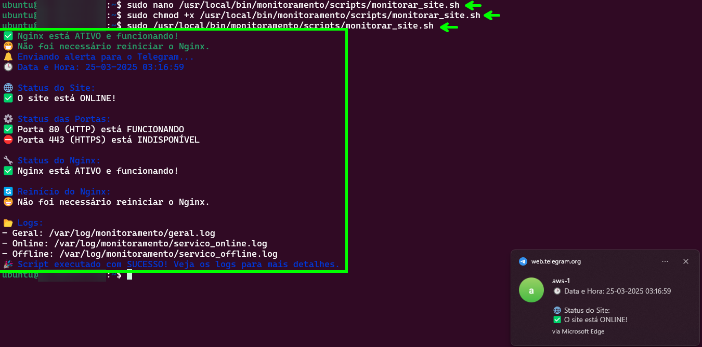


[🔼 Voltar ao Sumário](#sumário-)

## 🌐 3. Configurar o script para rodar automaticamente a cada 1 minuto usando cron ou systemd timers.

[🔼 Voltar ao Sumário](#sumário-)

```bash
    sudo apt install cron -y
```

Após a instalação, inicie e habilite o serviço do **cron** para que ele inicie automaticamente com o sistema:
    
```bash
 sudo systemctl enable cron
```

Verifique se está funcionando corretamente:

```bash
   sudo systemctl status cron
```

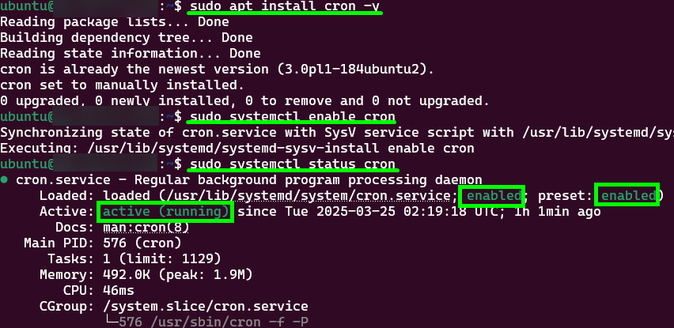
 
Edite o arquivo **crontab** para adicionar o agendamento de execução do script a cada minuto:

```bash
   crontab -e
```

Vai aparecer uma mensagem. Você digitará `1` e irá apertar `enter`:


Adicione a seguinte linha para rodar o script a cada 5 minutos (ajuste conforme sua necessidade):

```bash
   */1 * * * * /usr/local/bin/monitoramento/scripts/monitorar_site.sh
```

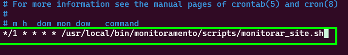

Para salvar e sair do editor `nano`, pressione `CTRL + X`, depois `Y` e `ENTER`.

⚠️ Deixar HTTP do security group como 0.0.0.0/0
Agora que as configurações já foram feitas, podemos deixar o
aberto para todos.

Na página da AWS pesquise por security groups, clique no que
você criou para esse projeto, depois clique com o botão direito e selecione a opção `Edite inbound rules`


No HTTP vc vai mudar para `Anywhere iPv4` e salvar a mudança.

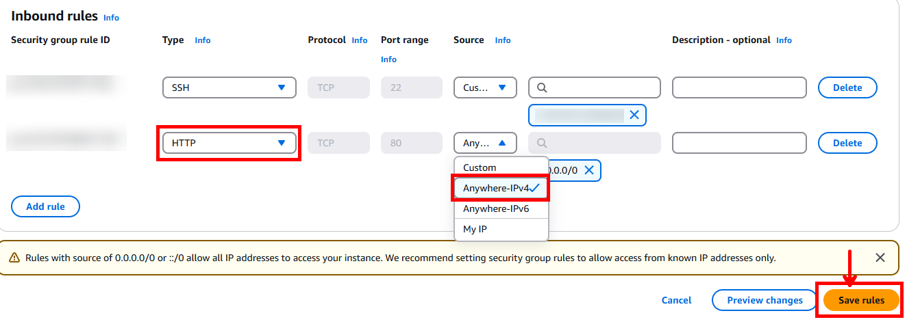

Agora tente acessar, por exemplo, do seu celular, abrindo o navegador e digitando:
http://IP_DA_INSTANCIA

# Etapa 4: Automação e Testes ☁️

[🔼 Voltar ao Sumário](#sumário-)

## 🌐 1.1 Testar a implementação: Verificar se o site está acessível via navegador.

[🔼 Voltar ao Sumário](#sumário-)

## 🌐 1.2 Testar a implementação: Parar o Nginx e verificar se o script detecta e envia alertas corretamente.

[🔼 Voltar ao Sumário](#sumário-)

<p align="center">
  <br>
  
</p>

<!-- curl https://api.telegram.org/bot7726032205:AAF_Qd-xtf8wuI-vdefagsOzUbaYJy7CJ9s/getUpdates
5740122051 -->
<!--
nano monitor_site.sh -->
