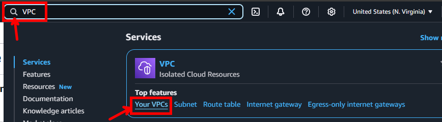
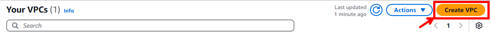
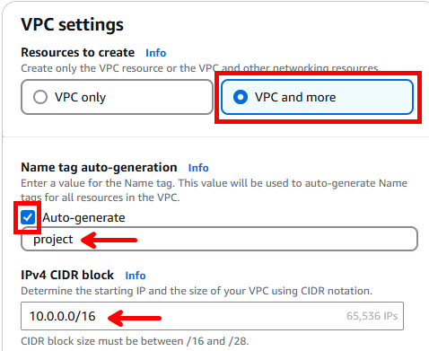
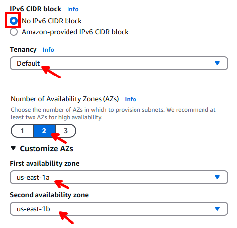
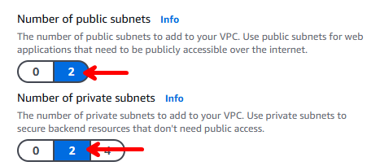
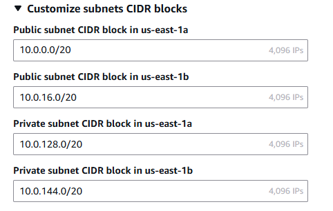
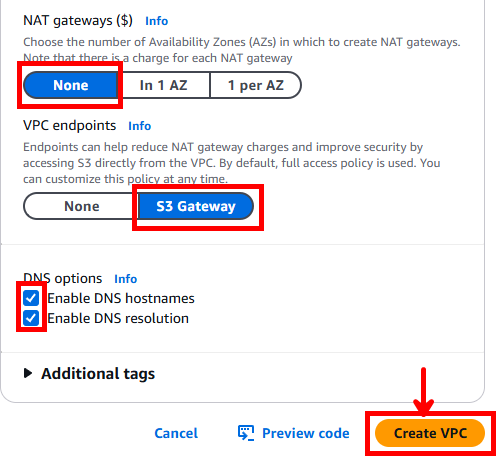
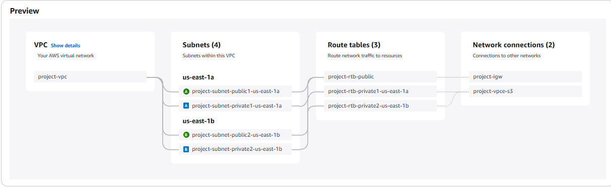

# Documentação do Projeto DevSecOps ☁️

## Ferramentas Úteis

### ZoomIt da Microsoft para Prints de Tela com Setas
Para capturar telas com anotações, utilizamos o ZoomIt da Microsoft.

- Documentação e instalação do ZoomIt: [ZoomIt - Sysinternals | Microsoft Learn](https://learn.microsoft.com/pt-br/sysinternals/downloads/zoomit)

## Pré-Requisitos
Antes de iniciar a configuração, certifique-se de que possui os seguintes requisitos atendidos:

- **Conta ativa na AWS**
  > **O que é AWS?**
  > Amazon Web Services (AWS) é uma plataforma de computação em nuvem que fornece infraestrutura sob demanda, como servidores, armazenamento e bancos de dados, permitindo que desenvolvedores criem e escalem aplicações rapidamente.

- **WSL instalado no PC (caso esteja utilizando Windows)**
  > **O que é WSL?**
  > O Windows Subsystem for Linux (WSL) permite rodar um ambiente Linux diretamente no Windows sem precisar de uma máquina virtual, facilitando o desenvolvimento e administração de servidores remotos.

- Guia de instalação do Ubuntu no Windows: [How to install Ubuntu on Windows 10 from Microsoft Store](https://www.youtube.com/watch?v=La8jIAAANSA&t=203s)
- Documentação do WSL: [Documentação do Subsistema Windows para Linux | Microsoft Learn](https://learn.microsoft.com/pt-br/windows/wsl/)

> **Observação:** Minha console está em inglês. Caso os nomes dos menus estejam diferentes na sua, pode ser devido ao idioma configurado.

---

# Etapa 1: Configuração do Ambiente

## 1. Criar VPC
A **Virtual Private Cloud (VPC)** é uma rede virtual isolada dentro da AWS onde serão configurados os recursos do projeto.

### Passos para criação:

1. No console da tela inicial da AWS, vá até a lupa e pesquise por "VPC".
   

2. Irá abrir a página de gerenciamento de VPCs. Clique em **"Create VPC"**.
   
   

3. Nas configurações, selecione **"VPC and more"**.
   - Marque "Auto-generate"
   - Defina um nome para sua VPC (exemplo: "project")
   - Defina o **IPv4 CIDR block** como **10.0.0.0/16**
   
   > **O que é IPv4 CIDR block?**
   > CIDR (Classless Inter-Domain Routing) é um método para definir intervalos de endereços IP. O bloco **10.0.0.0/16** significa que a VPC pode ter até 65.536 endereços IP disponíveis dentro deste intervalo.
   
   

4. Configure as seguintes opções:
   - **IPv6 CIDR block**: "No IPv6 CIDR block"
   
   > **O que é IPv6 CIDR block?**
   > Diferente do IPv4, o IPv6 usa um esquema de endereçamento maior e mais complexo. No projeto, optamos por não utilizar IPv6.
   
   - **Tenancy**: "Default"
   
   > **O que é Tenancy?**
   > Define como os recursos da AWS são alocados. A opção "Default" significa que a VPC compartilhará a infraestrutura física da AWS com outros usuários, reduzindo custos.
   
   - **Número de AZs (Availability Zones)**: 2
   - Customizei para "us-east-1a" (Virgínia) e "us-east-1b" (Ohio)
   
   > **O que são Availability Zones (AZs)?**
   > Availability Zones são localizações distintas dentro de uma região AWS. Cada região possui múltiplas AZs, que são centros de dados isolados fisicamente, garantindo maior disponibilidade e tolerância a falhas.
   
   

5. Como o projeto exige, configure **duas subnets públicas e duas privadas**.
   
   > **O que são subnets públicas e privadas?**
   > - **Subnets públicas**: Permitem comunicação direta com a internet através de um Internet Gateway.
   > - **Subnets privadas**: Ficam isoladas da internet e precisam de um NAT Gateway para acessar recursos externos.
   
   

6. Configure o CIDR block das subnets como **10.0.0.0/20**.
   
   > **O que significa CIDR block das subnets como 10.0.0.0/20?**
   > Cada subnet recebe uma parte do bloco de endereços da VPC. **/20** significa que cada subnet pode ter até 4.096 endereços IP disponíveis.
   
   

7. Configure as opções adicionais:
   - **NAT Gateways ($):** "None"
   
   > **O que é NAT Gateway?**
   > Um NAT Gateway permite que instâncias em subnets privadas acessem a internet sem serem diretamente acessíveis por ela.
   
   - **VPC Endpoints:** Selecione "S3 Gateway"
   
   > **O que são VPC Endpoints e S3 Gateway?**
   > Um **VPC Endpoint** permite que recursos dentro da VPC se comuniquem com serviços da AWS sem passar pela internet. O **S3 Gateway** é um tipo de endpoint usado para acessar o Amazon S3 de forma segura e eficiente.
   
   - **Habilitar DNS:** Marque as opções "Enable DNS hostnames" e "Enable DNS resolution"
   
   > **O que é DNS e por que habilitá-lo?**
   > O DNS (Domain Name System) traduz endereços IP em nomes legíveis. Habilitá-lo permite que instâncias dentro da VPC se comuniquem mais facilmente usando nomes ao invés de IPs.
   
   - **Tags:** Não adicionei tags extras
   
   > **O que são Tags?**
   > Tags são rótulos personalizáveis usados para organizar e identificar recursos dentro da AWS, facilitando a administração.
   
8. Clique em **"Create VPC"** para finalizar a configuração.
   
   

9. O preview final ficará assim:
   
   

---

A próxima etapa será a configuração das tabelas de roteamento e internet gateway.

